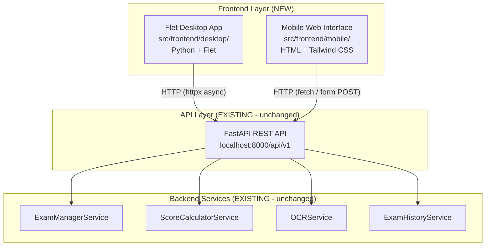
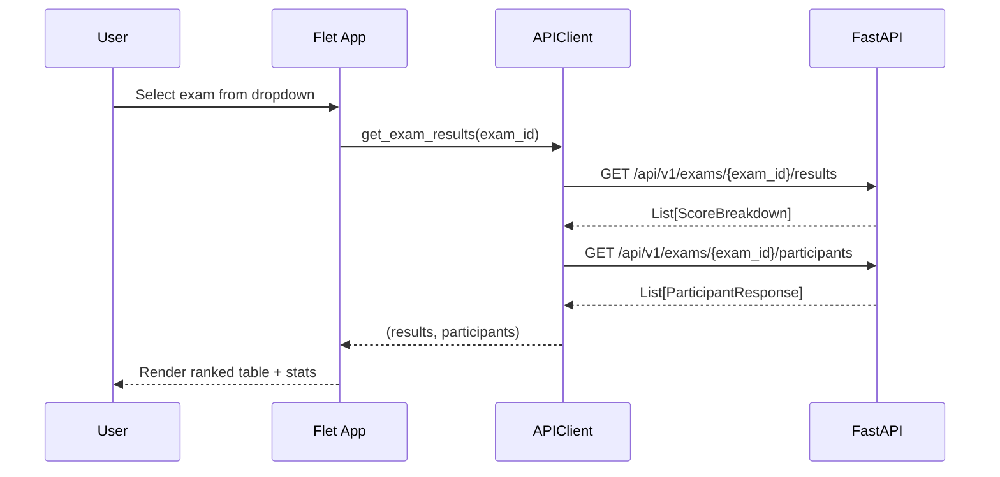
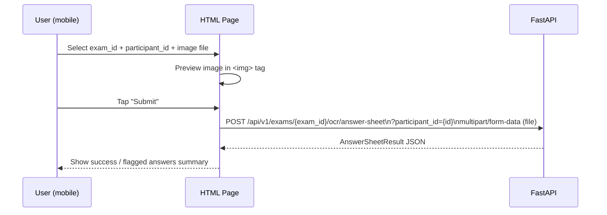
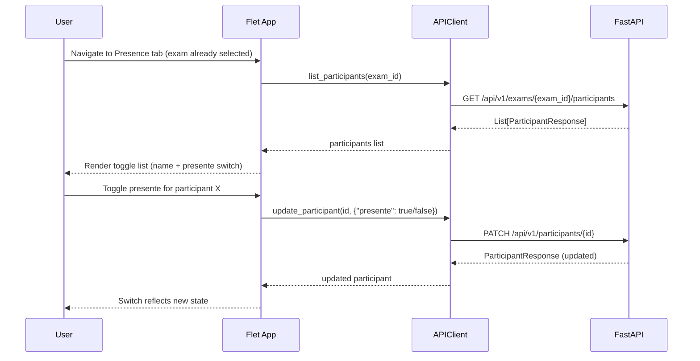
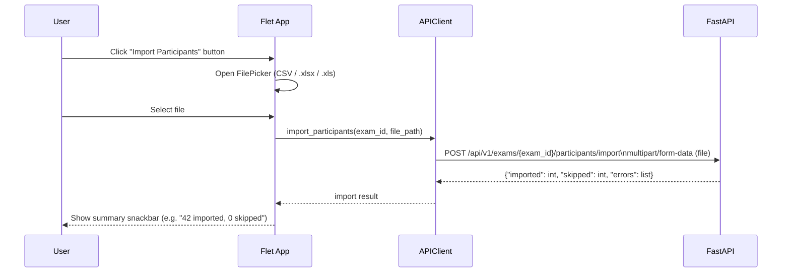
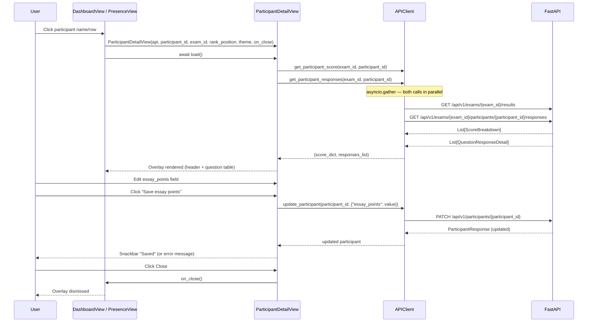
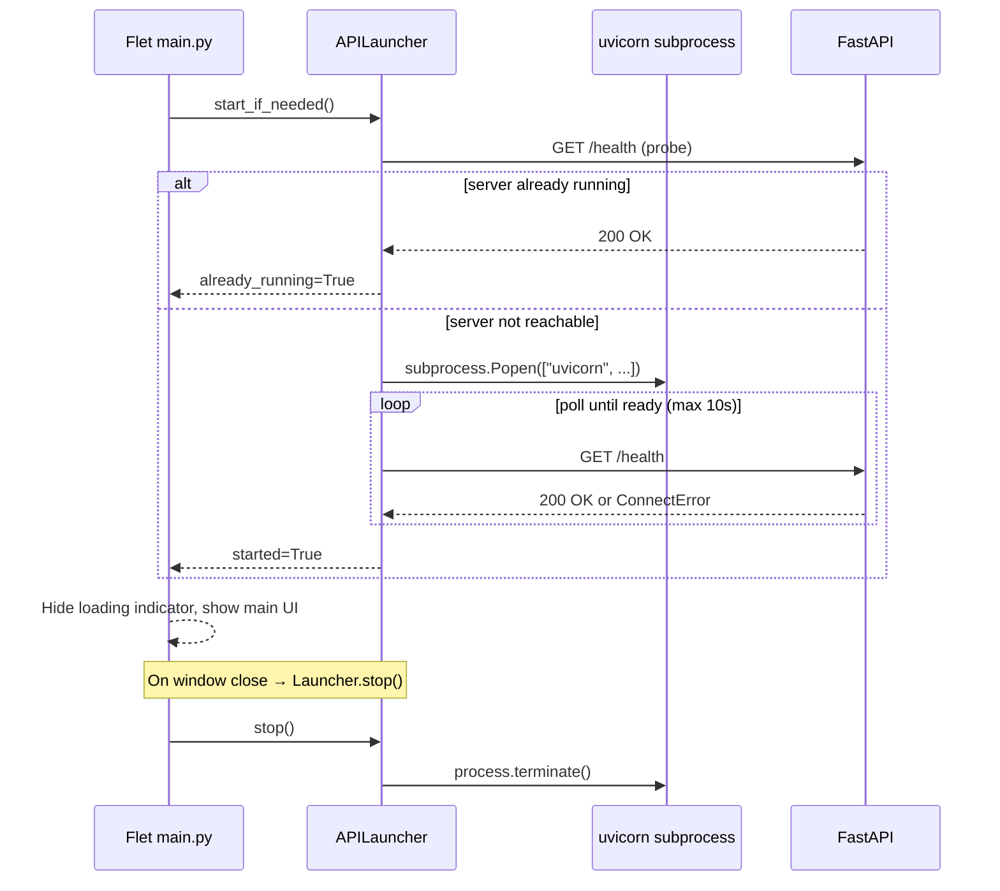
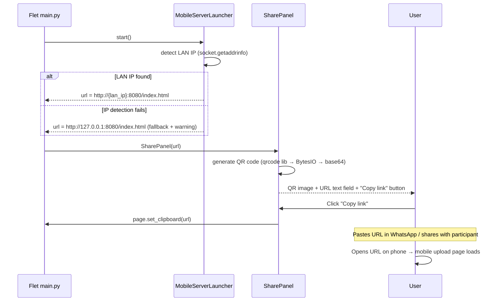
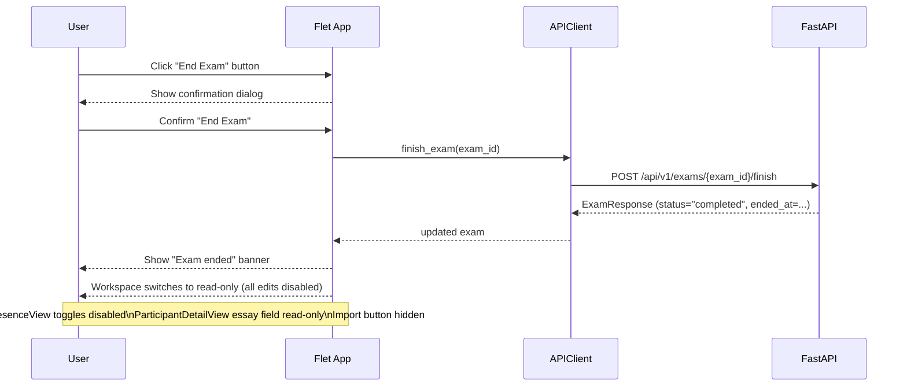
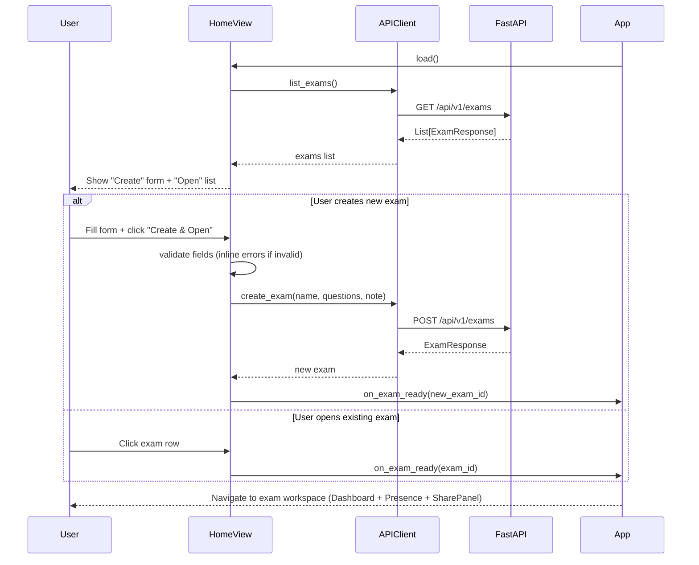

# Design Document: Frontend Refactor

## Overview

This document describes the frontend refactor for the "Enem da Read" system. The backend FastAPI migration is complete; this refactor introduces two new client interfaces that consume the existing REST API: a Flet-based desktop application for exam administration and real-time ranking, and a mobile-optimized HTML + Tailwind web page for uploading answer sheet images via OCR.

The backend receives minimal additions: a `?presente` query param on the participants list endpoint and a bulk-import endpoint for CSV/Excel files. All other backend services remain unchanged. All frontend components communicate exclusively through the `/api/v1` endpoints.

## Architecture

### High-Level Architecture



### Directory Layout

```
src/frontend/
├── desktop/
│   ├── main.py              # Flet app entry point (auto-starts API)
│   ├── api_client.py        # Async HTTP client wrapper (httpx)
│   ├── api_launcher.py      # APILauncher: subprocess management for uvicorn
│   ├── mobile_server.py     # MobileServerLauncher (static file server + LAN IP)
│   ├── theme.py             # Color themes and style constants
│   ├── i18n.py              # Translation strings + t() helper
│   ├── app_config.py        # Config persistence (language, theme)
│   └── views/
│       ├── home.py               # HomeView: create or open exam
│       ├── dashboard.py          # Participants + rankings view
│       ├── exams.py              # Exam selector / list view
│       ├── presence.py           # PresenceView: attendance toggle list
│       ├── participant_detail.py # ParticipantDetailView: per-participant drill-down
│       ├── language_select.py    # First-launch language selection screen
│       └── components.py         # Shared reusable Flet controls (includes SharePanel, LanguageSwitcher)
└── mobile/
    ├── index.html           # Upload page (answer sheet) — bilingual (pt_BR / en)
    └── static/
        └── upload.js        # Fetch-based form submission logic
```

## Sequence Diagrams

### Flet Desktop: Load Dashboard



### Mobile Web: Upload Answer Sheet



### Flet Desktop: Presence List



### Flet Desktop: Bulk Import Participants



### Flet Desktop: Open Participant Detail



### Flet Desktop: Auto-Start API



### Flet Desktop: Mobile URL Sharing



### Flet Desktop: End Exam



### Flet Desktop: HomeView — Create or Open Exam



## Components and Interfaces

### 1. APIClient (Flet Desktop)

**Purpose**: Thin async wrapper around `httpx.AsyncClient` that centralises the base URL and error handling for all desktop API calls.

**Interface**:
```python
class APIClient:
    def __init__(self, base_url: str = "http://localhost:8000/api/v1") -> None: ...

    async def list_exams(self) -> list[dict]: ...
    async def get_exam_results(self, exam_id: int) -> list[dict]: ...
    async def get_exam_statistics(self, exam_id: int) -> dict: ...
    async def list_participants(self, exam_id: int, presente: bool | None = None) -> list[dict]: ...
    async def update_participant(self, participant_id: int, payload: dict) -> dict: ...
    async def add_participant(self, exam_id: int, nome: str) -> dict: ...
    async def import_participants(self, exam_id: int, file_path: str) -> dict: ...
    # {"imported": int, "skipped": int, "errors": list[str]}
    async def get_participant_score(self, exam_id: int, participant_id: int) -> dict: ...
    # calls GET /exams/{exam_id}/results and finds the participant entry
    async def get_participant_responses(self, exam_id: int, participant_id: int) -> list[dict]: ...
    # calls GET /exams/{exam_id}/participants/{participant_id}/responses
    async def create_exam(self, name: str, questions_numbers: int, symbolic_note: int) -> dict: ...
    # calls POST /api/v1/exams; returns ExamResponse dict
    async def finish_exam(self, exam_id: int) -> dict: ...
    # calls POST /api/v1/exams/{exam_id}/finish; returns ExamResponse with status="completed" and ended_at set
    # raises APIError(404) if exam not found; raises APIError(409) if already completed
```

**Responsibilities**:
- Holds a single `httpx.AsyncClient` instance (connection reuse)
- Raises `APIError` on non-2xx responses with the JSON detail message
- All methods are `async`; callers use `await`
- `list_participants` passes `?presente=true/false` when the argument is provided
- `import_participants` opens the file at `file_path` and POSTs it as `multipart/form-data`
- `create_exam` POSTs to `POST /api/v1/exams` and returns the new `ExamResponse` dict

### 2. HomeView (Flet Desktop)

**Purpose**: Entry screen shown on app startup. Lets the user create a new exam or open an existing one before entering the exam workspace.

**File**: `src/frontend/desktop/views/home.py`

**Interface**:
```python
class HomeView(ft.UserControl):
    def __init__(
        self,
        api: APIClient,
        theme: ThemeConfig,
        on_exam_ready: Callable[[int], None],  # called with exam_id when ready
    ) -> None: ...
    async def load(self) -> None: ...  # fetches existing exams for the "Open" list
    def build(self) -> ft.Control: ...
```

**Responsibilities**:
- Section A — Create New Exam: `ft.TextField` for exam name (required), number of questions (int > 0), symbolic note / max score (int > 0); "Create & Open" button calls `create_exam()` then `on_exam_ready(new_exam_id)`; inline validation shows field-level errors without making an API call
- Section B — Open Existing Exam: scrollable list of exams fetched via `list_exams()`; each row shows name, status badge, question count, created date; clicking a row calls `on_exam_ready(exam_id)`; empty state shows "No exams yet. Create one above."; refresh button reloads the list
- Both sections are displayed side by side (or stacked on small windows)
- `on_exam_ready(exam_id)` is the single exit point; the main app replaces `HomeView` with the exam workspace

### 3. MobileServerLauncher (Flet Desktop)

**Purpose**: Starts a lightweight static HTTP server (Python's built-in `http.server`) in a daemon thread to serve the `src/frontend/mobile/` directory over the local network, enabling mobile participants to access the upload page via a URL.

**File**: `src/frontend/desktop/mobile_server.py`

**Interface**:
```python
class MobileServerLauncher:
    def __init__(self, mobile_dir: str, port: int = 8080) -> None: ...
    def start(self) -> str:
        """Start the static file server. Returns the full URL (http://{lan_ip}:{port}/index.html)."""
        ...
    def stop(self) -> None: ...
    @property
    def url(self) -> str: ...
    @property
    def lan_ip(self) -> str: ...
```

**Responsibilities**:
- Detects the machine's LAN IP by iterating `socket.getaddrinfo(socket.gethostname(), None)` and selecting the first non-loopback IPv4 address; falls back to `127.0.0.1` with a logged warning if detection fails
- If the requested port is already in use, retries on `port+1` and `port+2` (up to 3 attempts total) before raising `OSError`
- Starts `http.server.HTTPServer` (serving `mobile_dir`) in a `threading.Thread(daemon=True)` so it shuts down automatically when the Flet process exits
- `stop()` calls `server.shutdown()` on the background thread
- `url` property returns `http://{lan_ip}:{actual_port}/index.html`

### 4. SharePanel (Flet Desktop)

**Purpose**: Displays the mobile upload URL as a QR code and a copyable text field so the exam administrator can share it with participants (e.g. via WhatsApp).

**File**: `src/frontend/desktop/views/components.py` (added to existing shared components)

**Interface**:
```python
class SharePanel(ft.UserControl):
    def __init__(self, url: str, theme: ThemeConfig) -> None: ...
    def build(self) -> ft.Control: ...
```

**Responsibilities**:
- Generates a QR code image using the `qrcode` library: `qrcode.make(url)` → saves to `io.BytesIO` → base64-encodes → passes to `ft.Image(src_base64=...)`
- Shows the URL in a read-only `ft.TextField`
- "Copy link" button calls `page.set_clipboard(url)`
- Displayed in the exam workspace header (e.g. as a collapsible panel in the top bar or a dedicated "Share" tab)

### 5. DashboardView (Flet Desktop)

**Purpose**: Main view showing a ranked participant table and aggregate statistics for the selected exam.

**Interface**:
```python
class DashboardView(ft.UserControl):
    def __init__(self, api: APIClient, exam_id: int, theme: ThemeConfig, read_only: bool = False) -> None: ...
    async def load(self) -> None: ...          # fetches data, rebuilds table
    def build(self) -> ft.Control: ...         # returns the Flet control tree
```

**Responsibilities**:
- Displays a `ft.DataTable` with columns: Rank, Name, Score, Accuracy %
- Shows a stats row (avg, highest, lowest score) above the table
- Exposes a refresh button that calls `load()` again (refresh still works in read-only mode)
- Applies the active `ThemeConfig` colors
- When `read_only=True`: clicking a participant row still opens `ParticipantDetailView` (in read-only mode)

### 6. ExamsView (Flet Desktop)

**Purpose**: Exam selector dropdown and list; entry point for navigating to a dashboard.

**Interface**:
```python
class ExamsView(ft.UserControl):
    def __init__(self, api: APIClient, on_select: Callable[[int], None]) -> None: ...
    async def load(self) -> None: ...
    def build(self) -> ft.Control: ...
```

**Responsibilities**:
- Fetches and renders the list of exams
- Calls `on_select(exam_id)` when the user picks an exam
- Shows exam name, status badge, and question count

### 7. ThemeConfig (Flet Desktop)

**Purpose**: Centralised color and style constants; supports multiple named themes.

**Interface**:
```python
@dataclass
class ThemeConfig:
    name: str
    primary: str        # hex color
    secondary: str
    background: str
    surface: str
    on_primary: str
    on_background: str

THEMES: dict[str, ThemeConfig] = {
    "dark_blue": ThemeConfig(...),
    "dark_green": ThemeConfig(...),
    "light": ThemeConfig(...),
    "high_contrast": ThemeConfig(...),
}
```

### 8. Mobile Upload Page

**Purpose**: Single-page mobile web interface for submitting an answer sheet image to the OCR endpoint.

**Responsibilities**:
- `<select>` for exam selection (populated via `GET /api/v1/exams` on page load)
- `<input type="number">` for participant ID
- `<input type="file" accept="image/jpeg,image/png">` with live preview
- Submit button POSTs `multipart/form-data` to `/api/v1/exams/{exam_id}/ocr/answer-sheet?participant_id={id}`
- Displays result: success message or list of flagged questions
- Participant `<select>` is populated with only `presente=true` participants via `GET /api/v1/exams/{exam_id}/participants?presente=true`

### 9. PresenceView (Flet Desktop)

**Purpose**: Attendance management view showing all participants for the selected exam with a toggle for `presente`.

**Interface**:
```python
class PresenceView(ft.UserControl):
    def __init__(self, api: APIClient, exam_id: int, theme: ThemeConfig, read_only: bool = False) -> None: ...
    async def load(self) -> None: ...   # fetches participants, rebuilds list
    def build(self) -> ft.Control: ... # returns the Flet control tree
```

**Responsibilities**:
- Fetches all participants for the exam via `list_participants(exam_id)`
- Renders each participant as a row: name + `ft.Switch` (or `ft.Checkbox`) bound to `presente`
- On toggle: calls `update_participant(id, {"presente": new_value})` immediately (optimistic UI)
- On API error: reverts the switch to its previous state and shows a snackbar
- Accessible from the main navigation rail alongside the Dashboard tab
- When `read_only=True`: all `ft.Switch` toggles are `disabled=True`; the "Import Participants" button is hidden; clicking a participant name still opens `ParticipantDetailView` (read-only)

### 10. ParticipantDetailView (Flet Desktop)

**Purpose**: A panel/overlay that shows full detail for a single participant when their name is clicked — accessible from both `DashboardView` and `PresenceView`.

**File**: `src/frontend/desktop/views/participant_detail.py`

**Interface**:
```python
class ParticipantDetailView(ft.UserControl):
    def __init__(
        self,
        api: APIClient,
        participant_id: int,
        exam_id: int,
        rank_position: int,
        theme: ThemeConfig,
        on_close: Callable[[], None],
        read_only: bool = False,
    ) -> None: ...
    async def load(self) -> None: ...
    def build(self) -> ft.Control: ...
```

**Responsibilities**:
- Header row: participant name, rank badge (e.g. `#3`), final score
- Score breakdown row: normalized score, essay points (`ft.TextField`, editable), correct count / total questions, accuracy %
- "Save essay points" button → calls `PATCH /participants/{id}` with `{"essay_points": value}`; shows snackbar on success or error
- Per-question `ft.DataTable` with columns: Q# | Correct Answer | Their Answer | Result (✓ / ✗ / —) | Weight
- Close button that invokes `on_close()`
- Triggered from `DashboardView` (clicking a ranked row) and `PresenceView` (clicking a participant name, not the toggle switch); both pass `rank_position` derived from the sorted results list index
- When `read_only=True`: essay points `ft.TextField` is `read_only=True`; "Save essay points" button is hidden

### 11. APILauncher (Flet Desktop)

**Purpose**: Manages the lifecycle of the FastAPI/uvicorn subprocess so the desktop app is self-contained.

**File**: `src/frontend/desktop/api_launcher.py`

**Interface**:
```python
class APILauncher:
    def __init__(
        self,
        host: str = "127.0.0.1",
        port: int = 8000,
        app_module: str = "backend.api.app:app",
        poll_interval: float = 0.5,
        timeout: float = 10.0,
    ) -> None: ...

    async def start_if_needed(self) -> bool:
        """Returns True if the server was started by this launcher, False if already running."""
        ...

    def stop(self) -> None:
        """Terminate the subprocess if it was started by this launcher."""
        ...

    @property
    def health_url(self) -> str: ...
```

**Responsibilities**:
- Probes `GET /health` with `httpx`; if reachable, returns immediately
- If not reachable, spawns `subprocess.Popen(["uvicorn", app_module, "--host", host, "--port", str(port)])`
- Polls `/health` every `poll_interval` seconds until 200 or `timeout` exceeded
- Stores the `Popen` handle; `stop()` calls `process.terminate()` then `process.wait()`
- Only terminates the process it started (does not kill an externally-started server)

### 12. i18n Module (Flet Desktop)

**Purpose**: Provides translated UI strings for Portuguese (Brazil) and English via a simple dictionary lookup. No external i18n library is used.

**File**: `src/frontend/desktop/i18n.py`

**Interface**:
```python
# Supported languages
LANGUAGES = ["pt_BR", "en"]

# Translation dictionaries
STRINGS: dict[str, dict[str, str]] = {
    "pt_BR": {
        "app_title": "Enem da Read",
        "create_exam": "Criar Prova",
        "open_exam": "Abrir Prova",
        "exam_name": "Nome da Prova",
        "questions_count": "Número de Questões",
        "symbolic_note": "Nota Máxima",
        "create_and_open": "Criar e Abrir",
        "no_exams": "Nenhuma prova encontrada. Crie uma acima.",
        "dashboard": "Ranking",
        "presence": "Presença",
        "share": "Compartilhar",
        "copy_link": "Copiar Link",
        "import_participants": "Importar Participantes",
        "save": "Salvar",
        "close": "Fechar",
        "refresh": "Atualizar",
        "rank": "Pos.",
        "name": "Nome",
        "score": "Nota",
        "accuracy": "Acertos %",
        "essay_points": "Pontos Redação",
        "correct_answer": "Gabarito",
        "marked_answer": "Resposta",
        "result": "Resultado",
        "weight": "Peso",
        "present": "Presente",
        "language": "Idioma",
        "settings": "Configurações",
        "select_language": "Selecione o idioma",
        "error_required": "Campo obrigatório",
        "error_positive_int": "Deve ser um número inteiro positivo",
        "error_essay_points": "Pontos de redação devem ser ≥ 0",
        "saved": "Salvo",
        "upload_answer_sheet": "Enviar Gabarito",
        "select_exam": "Selecione a Prova",
        "select_participant": "Selecione o Participante",
        "select_image": "Selecionar Imagem",
        "submit": "Enviar",
        "mobile_server_warning": "Servidor móvel rodando apenas em localhost — compartilhamento via rede indisponível",
        "api_start_error": "Não foi possível iniciar o servidor. Inicie manualmente.",
        "connecting": "Conectando...",
        "end_exam": "Encerrar Prova",
        "end_exam_confirm": "Encerrar Prova? Esta ação não pode ser desfeita.",
        "end_exam_warning": "Após encerrar, nenhuma edição será permitida.",
        "cancel": "Cancelar",
        "exam_ended_at": "Encerrada em",
        "exam_completed": "Concluída",
        "view_only": "Somente Visualização",
        # ... (all UI strings)
    },
    "en": {
        "app_title": "Enem da Read",
        "create_exam": "Create Exam",
        "open_exam": "Open Exam",
        "exam_name": "Exam Name",
        "questions_count": "Number of Questions",
        "symbolic_note": "Max Score",
        "create_and_open": "Create & Open",
        "no_exams": "No exams yet. Create one above.",
        "dashboard": "Rankings",
        "presence": "Attendance",
        "share": "Share",
        "copy_link": "Copy Link",
        "import_participants": "Import Participants",
        "save": "Save",
        "close": "Close",
        "refresh": "Refresh",
        "rank": "Rank",
        "name": "Name",
        "score": "Score",
        "accuracy": "Accuracy %",
        "essay_points": "Essay Points",
        "correct_answer": "Answer Key",
        "marked_answer": "Response",
        "result": "Result",
        "weight": "Weight",
        "present": "Present",
        "language": "Language",
        "settings": "Settings",
        "select_language": "Select language",
        "error_required": "Required field",
        "error_positive_int": "Must be a positive integer",
        "error_essay_points": "Essay points must be ≥ 0",
        "saved": "Saved",
        "upload_answer_sheet": "Upload Answer Sheet",
        "select_exam": "Select Exam",
        "select_participant": "Select Participant",
        "select_image": "Select Image",
        "submit": "Submit",
        "mobile_server_warning": "Mobile server running on localhost only — LAN sharing unavailable",
        "api_start_error": "Could not start API server. Please start it manually.",
        "connecting": "Connecting...",
        "end_exam": "End Exam",
        "end_exam_confirm": "End Exam? This action cannot be undone.",
        "end_exam_warning": "After ending, no edits will be allowed.",
        "cancel": "Cancel",
        "exam_ended_at": "Ended at",
        "exam_completed": "Completed",
        "view_only": "View Only",
        # ... (all UI strings)
    },
}

# Active language (module-level state)
_active_lang: str = "pt_BR"

def set_language(lang: str) -> None:
    """Set the active language. Raises ValueError if lang not in LANGUAGES."""
    global _active_lang
    if lang not in LANGUAGES:
        raise ValueError(f"Unsupported language: {lang}")
    _active_lang = lang

def get_language() -> str:
    """Return the currently active language code."""
    return _active_lang

def t(key: str) -> str:
    """Return the translated string for key in the active language.
    Falls back to the key itself if not found."""
    return STRINGS.get(_active_lang, {}).get(key, key)
```

**Usage in views**:
```python
from frontend.desktop.i18n import t

ft.Text(t("dashboard"))        # "Ranking" or "Rankings"
ft.ElevatedButton(t("save"))   # "Salvar" or "Save"
```

**Responsibilities**:
- Holds all UI strings for both supported languages in a single module
- `t(key)` is the sole access point for translated strings throughout all views
- Falls back to the key string itself if a translation is missing (no crash, no `None`)
- Module-level `_active_lang` state is set once at startup and optionally changed from settings

---

### 13. AppConfig (Flet Desktop)

**Purpose**: Persists user preferences (language, theme) to a JSON file at `~/.enem_da_read/config.json` so settings survive app restarts.

**File**: `src/frontend/desktop/app_config.py`

**Interface**:
```python
import json
from pathlib import Path

CONFIG_PATH = Path.home() / ".enem_da_read" / "config.json"

def load_config() -> dict:
    """Load config from disk. Returns defaults if file doesn't exist."""
    if CONFIG_PATH.exists():
        return json.loads(CONFIG_PATH.read_text())
    return {"language": "pt_BR", "theme": "dark_blue"}

def save_config(config: dict) -> None:
    """Persist config to disk."""
    CONFIG_PATH.parent.mkdir(parents=True, exist_ok=True)
    CONFIG_PATH.write_text(json.dumps(config, indent=2))
```

**Responsibilities**:
- Returns safe defaults (`{"language": "pt_BR", "theme": "dark_blue"}`) when no config file exists (first launch)
- Creates `~/.enem_da_read/` directory automatically on first save
- Uses stdlib `json` and `pathlib` only — no external dependencies

---

### 14. LanguageSelectView (Flet Desktop)

**Purpose**: Shown on first launch (when no config file exists) before `HomeView`. Lets the user pick their preferred language once; the choice is persisted and the screen is never shown again.

**File**: `src/frontend/desktop/views/language_select.py`

**Interface**:
```python
class LanguageSelectView(ft.UserControl):
    def __init__(
        self,
        on_language_selected: Callable[[str], None],
    ) -> None: ...
    def build(self) -> ft.Control: ...
```

**What it displays**:
- App logo / title ("Enem da Read")
- Subtitle: "Selecione o idioma / Select language"
- Two large buttons: "🇧🇷 Português (BR)" and "🇺🇸 English"
- Clicking either calls `on_language_selected("pt_BR")` or `on_language_selected("en")`

**Responsibilities**:
- Calls `on_language_selected(lang)` with the chosen language code
- Does not call `set_language()` or `save_config()` directly — the caller (`main.py`) handles persistence
- Displayed only when `load_config()["language"]` is `None` (i.e., config file did not exist)

---

### 15. LanguageSwitcher (Flet Desktop)

**Purpose**: A settings control that lets the user change the active language after the initial selection. Accessible via a gear icon in the app bar.

**File**: `src/frontend/desktop/views/components.py` (added to existing shared components)

**Interface**:
```python
class LanguageSwitcher(ft.UserControl):
    def __init__(self, on_change: Callable[[str], None], theme: ThemeConfig) -> None: ...
    def build(self) -> ft.Control: ...
    # Renders a ft.Dropdown with "Português (BR)" and "English" options
```

**Responsibilities**:
- Renders a `ft.Dropdown` pre-selected to the current `get_language()` value
- On selection change: calls `on_change(lang)`, which the caller uses to call `set_language(lang)`, `save_config(...)`, and `page.update()` to re-render all translated text

---

### 17. End Exam Button & Confirmation Dialog (Flet Desktop)

**Purpose**: Allows the exam administrator to permanently lock the exam, transitioning it to `completed` status and making the entire workspace read-only.

**File**: `src/frontend/desktop/views/components.py` (added to existing shared components)

**Interface**:
```python
class EndExamButton(ft.UserControl):
    def __init__(
        self,
        api: APIClient,
        exam_id: int,
        theme: ThemeConfig,
        on_exam_ended: Callable[[dict], None],  # called with updated exam dict
    ) -> None: ...
    def build(self) -> ft.Control: ...
```

**Responsibilities**:
- Displayed in the exam workspace header (next to SharePanel / theme switcher)
- Only visible when `exam["status"] != "completed"`; hidden once the exam is completed
- Clicking opens a `ft.AlertDialog` confirmation with:
  - Title: `t("end_exam_confirm")`
  - Body: `t("end_exam_warning")`
  - Cancel button: `t("cancel")` (neutral style)
  - Confirm button: `t("end_exam")` (destructive/error color)
- On confirm: calls `api.finish_exam(exam_id)`, then invokes `on_exam_ended(updated_exam)`
- On 409 response: treats as success (exam already ended); calls `on_exam_ended` with available data
- On other API error: shows snackbar; re-enables the button

---

### 18. Read-Only Banner (Flet Desktop)

**Purpose**: Informs the administrator that the exam is locked and no edits are permitted.

**File**: `src/frontend/desktop/views/components.py`

**Interface**:
```python
class ReadOnlyBanner(ft.UserControl):
    def __init__(self, ended_at: str, theme: ThemeConfig) -> None: ...
    def build(self) -> ft.Control: ...
```

**Responsibilities**:
- Displayed at the top of the exam workspace when `exam["status"] == "completed"`
- Shows a lock icon (🔒) and the text `t("exam_ended_at") + " " + format_datetime(ended_at)`
- Uses a visually distinct background (e.g. warning/amber color) to draw attention
- Replaces the "End Exam" button in the header

---

### 19. HomeView: Completed Exam Display

**Purpose**: Completed exams in the `HomeView` exam list are visually distinguished from active ones.

**Responsibilities** (addition to existing `HomeView`):
- Completed exams show a 🔒 lock icon alongside the status badge
- Status badge text for completed exams uses `t("exam_completed")` ("Concluída" / "Completed")
- Clicking a completed exam row still calls `on_exam_ready(exam_id)`, which opens the workspace in read-only mode

---

### 16. Mobile Web i18n

**Purpose**: The mobile HTML upload page (`index.html`) supports both languages via an inline JS translation object and a flag toggle in the page header. Language preference persists in `localStorage`.

**File**: `src/frontend/mobile/index.html` (inline `<script>`)

**Interface**:
```javascript
const STRINGS = {
  pt_BR: {
    title: "Enviar Gabarito",
    selectExam: "Selecione a Prova",
    selectParticipant: "Selecione o Participante",
    selectImage: "Selecionar Imagem",
    submit: "Enviar",
    success: "Enviado com sucesso!",
    flagged: "questões sinalizadas para revisão",
    error: "Erro",
    networkError: "Erro de rede. Tente novamente.",
    fileTooLarge: "O arquivo deve ter menos de 5 MB",
    invalidFileType: "Apenas JPEG e PNG são aceitos",
  },
  en: {
    title: "Upload Answer Sheet",
    selectExam: "Select Exam",
    selectParticipant: "Select Participant",
    selectImage: "Select Image",
    submit: "Submit",
    success: "Submitted successfully!",
    flagged: "questions flagged for review",
    error: "Error",
    networkError: "Network error. Please try again.",
    fileTooLarge: "File must be under 5 MB",
    invalidFileType: "Only JPEG and PNG are accepted",
  },
};

let activeLang = localStorage.getItem("lang") || "pt_BR";

function t(key) {
  return STRINGS[activeLang]?.[key] ?? key;
}

function setLanguage(lang) {
  activeLang = lang;
  localStorage.setItem("lang", lang);
  applyTranslations();
}

function applyTranslations() {
  document.querySelectorAll("[data-i18n]").forEach(el => {
    el.textContent = t(el.dataset.i18n);
  });
}

document.addEventListener("DOMContentLoaded", applyTranslations);
```

**Responsibilities**:
- All user-visible strings are referenced via `data-i18n` attributes on HTML elements
- `applyTranslations()` is called on `DOMContentLoaded` and after every `setLanguage()` call
- Language persists in `localStorage`; no server round-trip needed
- A small flag toggle (`🇧🇷` / `🇺🇸`) in the page header calls `setLanguage("pt_BR")` or `setLanguage("en")`

---

## Data Models

The frontend consumes the existing backend Pydantic schemas directly as JSON. Two new backend response shapes are introduced for the import endpoint and the filtered participants query.

### Consumed Response Shapes

```python
# From GET /api/v1/exams
ExamResponse = {
    "exam_id": int,
    "exam_name": str,
    "questions_numbers": int,
    "symbolic_note": int,
    "status": str,          # "draft" | "in_progress" | "completed"
    "created_at": str,
    "updated_at": str,
    "ended_at": str | None,  # set server-side when POST /finish is called; null until then
}

# From GET /api/v1/exams/{id}/results
ScoreBreakdown = {
    "participant_id": int,
    "participant_name": str,
    "raw_score": float,
    "normalized_score": float,
    "essay_points": float,
    "final_score": float,
    "correct_count": int,
    "total_questions": int,
    "accuracy_percentage": float,
}

# From GET /api/v1/exams/{id}/participants  (and ?presente=true)
ParticipantResponse = {
    "id": int,
    "exam_id": int,
    "nome": str,
    "presente": bool,
    "essay_points": float,
}

# From POST /api/v1/exams/{id}/ocr/answer-sheet
AnswerSheetResult = {
    "participant_id": int,
    "exam_id": int,
    "extracted_answers": [{"question_number": int, "answer": str, "confidence": float}],
    "avg_confidence": float,
    "flagged_count": int,
    "success": bool,
    "error_message": str | None,
}

# From POST /api/v1/exams/{exam_id}/participants/import  (NEW)
ImportResult = {
    "imported": int,   # rows successfully created
    "skipped": int,    # blank / duplicate rows ignored
    "errors": list[str],  # per-row error messages if any
}
```

### New Backend Endpoint: Participant Response Detail

`GET /api/v1/exams/{exam_id}/participants/{participant_id}/responses`

Returns a per-question breakdown for a single participant, joining questions (`get_by_exam_id`) with responses (`get_by_participant_and_exam`):

- Questions with no response have `marked_answer: null` and `correct: false`
- Questions with no `question_correct_answer` have `correct_answer: null` and `correct: null`
- Ordered by `question_number` ascending
- Returns `404` if the exam or participant is not found

**New Pydantic schema** (`src/backend/schemas/scoring.py`):

```python
class QuestionResponseDetail(BaseModel):
    question_number: int
    correct_answer: Optional[str]
    marked_answer: Optional[str]
    correct: Optional[bool]
    peso: int
```

**Example response**:
```json
[
  {"question_number": 1, "correct_answer": "A", "marked_answer": "A", "correct": true,  "peso": 1},
  {"question_number": 2, "correct_answer": "B", "marked_answer": "C", "correct": false, "peso": 2}
]
```

### New Backend Endpoint: Bulk Import

`POST /api/v1/exams/{exam_id}/participants/import`

- Accepts `multipart/form-data` with a single field `file` (CSV or Excel `.xlsx`/`.xls`)
- CSV format: single column header `nome` or `Nome`, one name per row
- Excel format: single column header `Nome`, one name per row
- Skips blank rows and rows where the name is already present in the exam
- Returns `ImportResult`
- Raises `404` if `exam_id` does not exist
- Raises `422` if the file format is unrecognised or the required column is missing

### Backend Endpoint Change: Participants Filter

`GET /api/v1/exams/{exam_id}/participants` gains an optional query parameter:

| Param | Type | Default | Description |
|-------|------|---------|-------------|
| `presente` | `bool` | `None` | When provided, filters to only participants where `presente` matches |

Example: `GET /api/v1/exams/3/participants?presente=true` returns only present participants.

### Backend Entity Change: `ended_at` on Exam

`src/backend/entities/exam.py` — add the `ended_at` column:

```python
ended_at = Column(DateTime, nullable=True, default=None)
```

`src/backend/schemas/exam.py` — add to `ExamResponse` and `ExamUpdate`:

```python
# ExamResponse
ended_at: Optional[datetime] = None

# ExamUpdate
ended_at: Optional[datetime] = None
```

### New Backend Endpoint: Finish Exam

`POST /api/v1/exams/{exam_id}/finish`

- Sets `status = "completed"` and `ended_at = datetime.utcnow()` server-side
- Returns the updated `ExamResponse`
- Raises `404` if the exam does not exist
- Raises `409 Conflict` if the exam is already `completed` (idempotency guard)
- Does not accept a request body
- This is the only frontend-facing way to transition an exam to `completed`; direct `PATCH` to set `status = "completed"` remains possible for admin use

## Key Functions with Formal Specifications

### `APIClient.get_exam_results(exam_id)`

```python
async def get_exam_results(self, exam_id: int) -> list[dict]:
    ...
```

**Preconditions:**
- `exam_id` is a positive integer
- The FastAPI server is reachable at `base_url`

**Postconditions:**
- Returns a list of `ScoreBreakdown` dicts ordered by `final_score` descending (as returned by the API)
- Raises `APIError` if the server returns a non-2xx status
- Never returns `None`; returns `[]` if the exam has no participants

**Loop Invariants:** N/A (single HTTP call, no loops)

---

### `DashboardView.load()`

```python
async def load(self) -> None:
    ...
```

**Preconditions:**
- `self.exam_id` is set to a valid exam ID
- `self.api` is an initialised `APIClient`

**Postconditions:**
- `self._results` contains the fetched score list
- `self._stats` contains the fetched statistics dict
- The Flet page is updated (calls `self.update()`)
- On API error, an error banner is shown; the previous data remains visible

---

### Mobile `submitForm()` (JavaScript)

```javascript
async function submitForm(examId, participantId, file) { ... }
```

**Preconditions:**
- `examId` and `participantId` are positive integers
- `file` is a `File` object with `type` in `["image/jpeg", "image/png"]`
- File size ≤ 5 MB

**Postconditions:**
- On success: displays `AnswerSheetResult.flagged_count` and a success banner
- On HTTP error: displays the `detail` field from the JSON error body
- The submit button is re-enabled after the request completes (success or failure)

---

### `APIClient.import_participants(exam_id, file_path)`

```python
async def import_participants(self, exam_id: int, file_path: str) -> dict:
    ...
```

**Preconditions:**
- `exam_id` is a positive integer
- `file_path` points to a readable CSV or Excel file on the local filesystem

**Postconditions:**
- Returns an `ImportResult` dict with keys `imported`, `skipped`, `errors`
- Raises `APIError` on non-2xx response
- The file handle is always closed after the request

---

---

### `APIClient.finish_exam(exam_id)`

```python
async def finish_exam(self, exam_id: int) -> dict:
    ...
```

**Preconditions:**
- `exam_id` is a positive integer
- The FastAPI server is reachable

**Postconditions:**
- Returns the updated `ExamResponse` dict with `status == "completed"` and `ended_at` set to a non-null datetime string
- Raises `APIError` with status 404 if the exam does not exist
- Raises `APIError` with status 409 if the exam is already completed
- The exam's `ended_at` is set server-side (not client-side) to ensure consistent timestamps

**Loop Invariants:** N/A (single HTTP call)

### `ParticipantDetailView.load()`

```python
async def load(self) -> None:
    ...
```

**Preconditions:**
- `self.participant_id` and `self.exam_id` are positive integers referencing existing records
- `self.api` is an initialised `APIClient`

**Postconditions:**
- `self._score` contains the `ScoreBreakdown` dict for the participant (found by `participant_id` in the results list)
- `self._responses` contains the list of `QuestionResponseDetail` dicts ordered by `question_number`
- The Flet control tree is updated to show the header, score row, and question table
- On any `APIError`: an inline error message is shown inside the panel; no crash occurs
- The essay points `ft.TextField` is pre-populated with `self._score["essay_points"]`

**Loop Invariants:** N/A (two parallel HTTP calls via `asyncio.gather`, no loops in `load()`)

---

### `APIClient.get_participant_responses(exam_id, participant_id)`

```python
async def get_participant_responses(self, exam_id: int, participant_id: int) -> list[dict]:
    ...
```

**Preconditions:**
- `exam_id` and `participant_id` are positive integers
- The FastAPI server is reachable at `base_url`

**Postconditions:**
- Returns a list of `QuestionResponseDetail` dicts ordered by `question_number` ascending
- Raises `APIError` with status 404 if the exam or participant does not exist
- Never returns `None`; returns `[]` if the exam has no questions

**Loop Invariants:** N/A (single HTTP call)

---

### `APILauncher.start_if_needed()`

```python
async def start_if_needed(self) -> bool:
    ...
```

**Preconditions:**
- `uvicorn` is installed and on `PATH` (or accessible via the same Python environment)

**Postconditions:**
- Returns `False` if the server was already reachable (no subprocess started)
- Returns `True` if a subprocess was started and the server became reachable within `timeout`
- Raises `RuntimeError` if the server does not become reachable within `timeout`
- At most one subprocess is ever held by this instance

**Loop Invariants (polling loop):**
- Each iteration waits `poll_interval` seconds before the next probe
- Total elapsed time is tracked; loop exits when elapsed ≥ `timeout`

---

### `HomeView.load()`

```python
async def load(self) -> None:
    ...
```

**Preconditions:**
- `self.api` is an initialised `APIClient`
- The FastAPI server is reachable at `base_url`

**Postconditions:**
- `self._exams` contains the list of `ExamResponse` dicts returned by `list_exams()`
- The "Open Existing Exam" list is rendered with the fetched data
- On `APIError`: an inline error message is shown; the list renders as empty with a retry button
- The "Create New Exam" form is always rendered regardless of API availability

**Loop Invariants:** N/A (single HTTP call, no loops in `load()`)

---

### `MobileServerLauncher.start()`

```python
def start(self) -> str:
    ...
```

**Preconditions:**
- `self.mobile_dir` points to a readable directory containing `index.html`
- No other call to `start()` has been made on this instance

**Postconditions:**
- Returns the full URL string `http://{lan_ip}:{actual_port}/index.html`
- A daemon `threading.Thread` is running, serving `mobile_dir` via `http.server.HTTPServer`
- `self.url` and `self.lan_ip` properties return consistent values
- If LAN IP detection fails, `lan_ip` is `"127.0.0.1"` and a warning is logged
- If the initial port is in use, the server binds to `port+1` or `port+2` (up to 3 attempts); raises `OSError` if all attempts fail

**Loop Invariants (port retry loop):**
- `attempt` increments by 1 each iteration; loop exits when `attempt ≥ 3` or a port binds successfully
- Each failed attempt tries `base_port + attempt`

---

### `t(key)` (i18n)

```python
def t(key: str) -> str:
    ...
```

**Preconditions:**
- `key` is a non-empty string
- `set_language()` has been called at least once, or the module default `"pt_BR"` is active

**Postconditions:**
- Returns the translated string for `key` in the active language
- If `key` is not found in the active language dict, returns `key` itself (no crash)
- Never returns `None`

**Loop Invariants:** N/A (single dictionary lookup)

## Algorithmic Pseudocode

### Flet App Startup (with Auto-Start API and Language Loading)

```pascal
ALGORITHM startDesktopApp()
INPUT: none
OUTPUT: running Flet window

BEGIN
  config ← loadConfig()   // from app_config.py

  IF config["language"] IS null THEN
    // First launch: show language selection before anything else
    SHOW LanguageSelectView(on_language_selected=PROCEDURE(lang)
      set_language(lang)
      config["language"] ← lang
      saveConfig(config)
      PROCEED to API startup
    END PROCEDURE)
    WAIT for language selection
  ELSE
    set_language(config["language"])
  END IF

  launcher ← APILauncher(host="127.0.0.1", port=8000)
  mobileServer ← MobileServerLauncher(mobile_dir="src/frontend/mobile", port=8080)

  showLoadingIndicator(t("connecting"))

  TRY
    started ← AWAIT launcher.start_if_needed()
  CATCH RuntimeError
    DISPLAY errorDialog(t("api_start_error"))
    RETURN
  END TRY

  // Start static file server for mobile page; get shareable URL
  TRY
    mobileUrl ← mobileServer.start()
  CATCH OSError
    mobileUrl ← null
    DISPLAY warningSnackbar(t("mobile_server_warning"))
  END TRY

  hideLoadingIndicator()

  api ← APIClient(base_url="http://localhost:8000/api/v1")
  theme ← THEMES["dark_blue"]

  PROCEDURE openExamWorkspace(exam_id)
    exam      ← AWAIT api.get_exam(exam_id)
    read_only ← exam["status"] = "completed"
    dashboard  ← DashboardView(api, exam_id, theme, read_only=read_only)
    presence   ← PresenceView(api, exam_id, theme, read_only=read_only)
    AWAIT dashboard.load()
    AWAIT presence.load()
    IF mobileUrl IS NOT null THEN
      sharePanel ← SharePanel(url=mobileUrl, theme=theme)
      page.views.push(ExamWorkspace(tabs=[dashboard, presence], header=sharePanel))
    ELSE
      page.views.push(ExamWorkspace(tabs=[dashboard, presence]))
    END IF
    IF read_only THEN
      DISPLAY ReadOnlyBanner(ended_at=exam["ended_at"])
    ELSE
      DISPLAY EndExamButton(api, exam_id, theme, on_exam_ended=PROCEDURE(updated)
        workspace.set_read_only(ended_at=updated["ended_at"])
      END PROCEDURE)
    END IF
    page.update()
  END PROCEDURE

  homeView ← HomeView(api, theme, on_exam_ready=openExamWorkspace)
  AWAIT homeView.load()

  page.on_close ← PROCEDURE()
    launcher.stop()
    mobileServer.stop()
  END PROCEDURE

  page.add(
    ThemeSwitcher(themes=THEMES, on_change=apply_theme),
    homeView
  )
END
```

**Preconditions:**
- Flet runtime is available
- `uvicorn` is on PATH or in the active Python environment

**Postconditions:**
- A Flet window is open showing `HomeView`
- The API server is reachable (either pre-existing or started as subprocess)
- The mobile static file server is running (or a warning was shown if it failed)
- On window close, any subprocess started by the launcher and the mobile server thread are terminated

---

### APILauncher: Poll Until Ready
INPUT: health_url (str), poll_interval (float), timeout (float)
OUTPUT: success (bool)

BEGIN
  elapsed ← 0.0
  
  WHILE elapsed < timeout DO
    TRY
      response ← httpx.get(health_url, timeout=1.0)
      IF response.status_code = 200 THEN
        RETURN true
      END IF
    CATCH ConnectError
      // server not yet up, keep polling
    END TRY
    
    AWAIT asyncio.sleep(poll_interval)
    elapsed ← elapsed + poll_interval
  END WHILE
  
  RETURN false
END
```

**Loop Invariants:**
- `elapsed` increases monotonically by `poll_interval` each iteration
- The loop terminates in at most `ceil(timeout / poll_interval)` iterations

---

### MobileServerLauncher: Start Static Server

```pascal
ALGORITHM startMobileServer(mobile_dir, base_port)
INPUT: mobile_dir (str), base_port (int)
OUTPUT: url (str)

BEGIN
  // Step 1: Detect LAN IP
  lan_ip ← "127.0.0.1"   // default fallback
  TRY
    addr_infos ← socket.getaddrinfo(socket.gethostname(), null)
    FOR each info IN addr_infos DO
      ip ← info.address
      IF ip does NOT start with "127." AND ip contains "." THEN
        lan_ip ← ip
        BREAK
      END IF
    END FOR
  CATCH socket.gaierror
    LOG warning("LAN IP detection failed, falling back to 127.0.0.1")
  END TRY

  // Step 2: Bind server with port retry
  actual_port ← null
  attempt ← 0

  WHILE attempt < 3 DO
    candidate_port ← base_port + attempt
    TRY
      server ← HTTPServer((lan_ip, candidate_port), StaticFileHandler(mobile_dir))
      actual_port ← candidate_port
      BREAK
    CATCH OSError  // port in use
      attempt ← attempt + 1
    END TRY
  END WHILE

  IF actual_port IS null THEN
    RAISE OSError("All port attempts failed (" + base_port + " to " + (base_port+2) + ")")
  END IF

  // Step 3: Start daemon thread
  thread ← Thread(target=server.serve_forever, daemon=true)
  thread.start()

  url ← "http://" + lan_ip + ":" + actual_port + "/index.html"
  RETURN url
END
```

**Preconditions:**
- `mobile_dir` is a readable directory
- `base_port` is a valid port number (1–65535)

**Postconditions:**
- Returns a valid URL string
- A daemon thread is serving `mobile_dir` on `actual_port`
- `lan_ip` is either the detected LAN address or `"127.0.0.1"` (fallback)

**Loop Invariants (port retry):**
- `attempt` is in range `[0, 3)`; increments by 1 on each `OSError`
- `candidate_port = base_port + attempt` is distinct on each iteration

---

### HomeView: Create Exam Validation

```pascal
ALGORITHM validateAndCreateExam(name_field, questions_field, note_field, api, on_exam_ready)
INPUT: form fields (ft.TextField), api (APIClient), on_exam_ready (Callable)
OUTPUT: updated UI state or navigation

BEGIN
  valid ← true

  IF name_field.value.strip() IS blank THEN
    name_field.error_text ← "Exam name is required"
    valid ← false
  END IF

  IF questions_field.value IS NOT positive integer THEN
    questions_field.error_text ← "Must be a positive integer"
    valid ← false
  END IF

  IF note_field.value IS NOT positive integer THEN
    note_field.error_text ← "Must be a positive integer"
    valid ← false
  END IF

  page.update()

  IF NOT valid THEN
    RETURN   // no API call made
  END IF

  setCreateButton(disabled=true)

  TRY
    exam ← AWAIT api.create_exam(
      name=name_field.value.strip(),
      questions_numbers=parseInt(questions_field.value),
      symbolic_note=parseInt(note_field.value)
    )
    on_exam_ready(exam["exam_id"])
  CATCH APIError AS e
    DISPLAY snackbar("Error: " + e.message)
    setCreateButton(disabled=false)
  END TRY
END
```

**Preconditions:**
- All three `ft.TextField` controls are rendered and accessible
- `api` is an initialised `APIClient`

**Postconditions:**
- If any field is invalid: `error_text` is set on the offending field(s); no API call is made; create button remains enabled
- If all fields are valid: `create_exam()` is called; on success `on_exam_ready` is invoked; on API error a snackbar is shown and the button is re-enabled
- `error_text` is cleared on the next successful validation pass

---

### PresenceView: Toggle Presente

```pascal
ALGORITHM togglePresente(participant_id, new_value, switch_control)
INPUT: participant_id (int), new_value (bool), switch_control (ft.Switch)
OUTPUT: updated UI state

BEGIN
  previous_value ← NOT new_value
  
  TRY
    result ← AWAIT api.update_participant(participant_id, {"presente": new_value})
    // switch already reflects new_value (optimistic); no further UI change needed
  CATCH APIError AS e
    switch_control.value ← previous_value   // revert
    DISPLAY snackbar("Failed to update: " + e.message)
    page.update()
  END TRY
END
```

**Preconditions:**
- `participant_id` is a valid ID belonging to the current exam
- `switch_control` is the `ft.Switch` widget that triggered the event

**Postconditions:**
- On success: `switch_control.value` equals `new_value`; backend state updated
- On failure: `switch_control.value` reverted to `previous_value`; snackbar shown

---

### Bulk Import: Backend Processing

```pascal
ALGORITHM importParticipants(exam_id, file_bytes, filename)
INPUT: exam_id (int), file_bytes (bytes), filename (str)
OUTPUT: ImportResult

BEGIN
  IF exam does NOT exist THEN
    RAISE 404 NotFound
  END IF
  
  IF filename ends with ".csv" THEN
    rows ← parseCsv(file_bytes, column="nome")
  ELSE IF filename ends with ".xlsx" OR ".xls" THEN
    rows ← parseExcel(file_bytes, column="Nome")
  ELSE
    RAISE 422 UnprocessableEntity("Unsupported file format")
  END IF
  
  imported ← 0
  skipped  ← 0
  errors   ← []
  
  FOR each name IN rows DO
    IF name IS blank THEN
      skipped ← skipped + 1
      CONTINUE
    END IF
    
    TRY
      CREATE Participante(exam_id=exam_id, nome=name.strip(), presente=false)
      imported ← imported + 1
    CATCH DuplicateError
      skipped ← skipped + 1
    CATCH ValidationError AS e
      errors.append("Row '" + name + "': " + e.message)
    END TRY
  END FOR
  
  RETURN {"imported": imported, "skipped": skipped, "errors": errors}
END
```

**Preconditions:**
- `exam_id` refers to an existing exam
- `file_bytes` is a valid CSV or Excel file with the expected column

**Postconditions:**
- `imported + skipped + len(errors)` equals the total non-header rows in the file
- No partial writes: each row is committed independently (errors on one row do not roll back others)

---

### ParticipantDetailView: Save Essay Points

```pascal
ALGORITHM saveEssayPoints(participant_id, essay_points_field, snackbar)
INPUT: participant_id (int), essay_points_field (ft.TextField), snackbar (ft.SnackBar)
OUTPUT: updated UI state

BEGIN
  raw_value ← essay_points_field.value.strip()

  IF raw_value IS blank OR NOT isNumeric(raw_value) THEN
    snackbar.content ← "Please enter a valid number"
    snackbar.open ← true
    page.update()
    RETURN
  END IF

  value ← parseFloat(raw_value)

  IF value < 0 THEN
    snackbar.content ← "Essay points must be ≥ 0"
    snackbar.open ← true
    page.update()
    RETURN
  END IF

  setSaveButton(disabled=true)

  TRY
    updated ← AWAIT api.update_participant(participant_id, {"essay_points": value})
    snackbar.content ← "Saved"
    snackbar.open ← true
  CATCH APIError AS e
    snackbar.content ← "Error: " + e.message
    snackbar.open ← true
  END TRY

  setSaveButton(disabled=false)
  page.update()
END
```

**Preconditions:**
- `participant_id` is a valid ID belonging to the current exam
- `essay_points_field` is the `ft.TextField` rendered inside `ParticipantDetailView`

**Postconditions:**
- On success: backend `essay_points` updated; snackbar shows "Saved"
- On validation failure: snackbar shows the validation message; no API call is made
- On API error: snackbar shows the error detail; field value is unchanged
- Save button is always re-enabled after the attempt

---

### End Exam Flow

```pascal
ALGORITHM endExam(exam_id, workspace)
INPUT: exam_id (int), workspace (ExamWorkspace)
OUTPUT: updated UI state

BEGIN
  dialog ← ConfirmDialog(
    title=t("end_exam_confirm"),
    body=t("end_exam_warning"),
    confirm_label=t("end_exam"),
    cancel_label=t("cancel"),
    confirm_style=DESTRUCTIVE
  )

  confirmed ← AWAIT showDialog(dialog)

  IF NOT confirmed THEN
    RETURN
  END IF

  setEndExamButton(disabled=true)

  TRY
    updated_exam ← AWAIT api.finish_exam(exam_id)
    workspace.set_read_only(ended_at=updated_exam["ended_at"])
    DISPLAY banner(t("exam_ended_at") + " " + format_datetime(updated_exam["ended_at"]))
  CATCH APIError AS e
    IF e.status_code = 409 THEN
      // Already completed — treat as success, just refresh
      workspace.set_read_only(ended_at=e.detail)
    ELSE
      DISPLAY snackbar("Error: " + e.message)
      setEndExamButton(disabled=false)
    END IF
  END TRY
END
```

**Preconditions:**
- `exam_id` is a valid exam ID for the currently open workspace
- The workspace is currently in editable mode (`exam["status"] != "completed"`)

**Postconditions:**
- On success: workspace is in read-only mode; banner shows `ended_at`; "End Exam" button is hidden
- On 409: workspace is set to read-only (exam was already ended); no error shown to user
- On other API error: snackbar shown; button re-enabled; workspace remains editable

---

### Mobile Form Submission

```pascal
ALGORITHM submitAnswerSheet(formData)
INPUT: examId (int), participantId (int), imageFile (File)
OUTPUT: result display update

BEGIN
  IF examId ≤ 0 OR participantId ≤ 0 THEN
    DISPLAY "Please fill all fields"
    RETURN
  END IF

  IF imageFile IS NULL THEN
    DISPLAY "Please select an image"
    RETURN
  END IF

  setSubmitButton(disabled=true)
  showSpinner()

  body ← FormData()
  body.append("file", imageFile)

  url ← "/api/v1/exams/" + examId + "/ocr/answer-sheet?participant_id=" + participantId

  TRY
    response ← AWAIT fetch(url, method="POST", body=body)

    IF response.ok THEN
      result ← AWAIT response.json()
      DISPLAY successBanner(result.flagged_count, result.avg_confidence)
    ELSE
      error ← AWAIT response.json()
      DISPLAY errorBanner(error.detail)
    END IF

  CATCH networkError
    DISPLAY errorBanner("Network error. Please try again.")
  END TRY

  hideSpinner()
  setSubmitButton(disabled=false)
END
```

**Preconditions:**
- `examId` and `participantId` are valid positive integers
- `imageFile` is a JPEG or PNG ≤ 5 MB

**Postconditions:**
- Submit button is always re-enabled after completion
- User receives clear feedback (success or error)
- No page navigation occurs; result is shown inline

**Loop Invariants:** N/A

## Example Usage

### Flet Desktop App

```python
import flet as ft
from frontend.desktop.api_client import APIClient
from frontend.desktop.api_launcher import APILauncher
from frontend.desktop.mobile_server import MobileServerLauncher
from frontend.desktop.views.home import HomeView
from frontend.desktop.views.dashboard import DashboardView
from frontend.desktop.views.presence import PresenceView
from frontend.desktop.views.components import SharePanel
from frontend.desktop.theme import THEMES

async def main(page: ft.Page):
    page.title = "Enem da Read"
    page.theme_mode = ft.ThemeMode.DARK

    launcher = APILauncher()
    mobile_server = MobileServerLauncher(mobile_dir="src/frontend/mobile")
    loading = ft.ProgressRing()
    page.add(loading)

    started = await launcher.start_if_needed()
    mobile_url = mobile_server.start()  # returns LAN URL or 127.0.0.1 fallback
    page.remove(loading)

    api = APIClient()
    active_theme = THEMES["dark_blue"]

    async def open_exam_workspace(exam_id: int):
        exam = await api.list_exams()  # or a get_exam call
        read_only = any(e["exam_id"] == exam_id and e["status"] == "completed" for e in exam)
        dashboard = DashboardView(api=api, exam_id=exam_id, theme=active_theme, read_only=read_only)
        presence = PresenceView(api=api, exam_id=exam_id, theme=active_theme, read_only=read_only)
        share = SharePanel(url=mobile_url, theme=active_theme)
        await dashboard.load()
        await presence.load()
        page.views.append(ft.View("/exam", [share, dashboard, presence]))
        page.update()

    page.on_disconnect = lambda _: (launcher.stop(), mobile_server.stop())

    home = HomeView(api=api, theme=active_theme, on_exam_ready=open_exam_workspace)
    await home.load()
    page.add(home)

ft.app(target=main)
```

### APIClient Usage

```python
client = APIClient(base_url="http://localhost:8000/api/v1")

# List all exams
exams = await client.list_exams()

# Get ranked results for exam 3
results = await client.get_exam_results(exam_id=3)
# results[0] == {"participant_name": "Alice", "final_score": 920.0, ...}

# Add a participant
new_p = await client.add_participant(exam_id=3, nome="Carlos")

# List only present participants
present = await client.list_participants(exam_id=3, presente=True)

# Bulk import from Excel
result = await client.import_participants(exam_id=3, file_path="/tmp/turma.xlsx")
# result == {"imported": 42, "skipped": 1, "errors": []}

# Toggle presence
updated = await client.update_participant(participant_id=7, payload={"presente": True})

# Finish (lock) an exam
finished = await client.finish_exam(exam_id=3)
# finished == {"exam_id": 3, "status": "completed", "ended_at": "2024-01-15T10:30:00", ...}
```

### Mobile HTML Snippet

```html
<!-- Exam selector populated on page load -->
<select id="examSelect" class="w-full rounded border p-2"
        onchange="loadPresentParticipants(this.value)"></select>

<!-- Participant selector – populated with presente=true participants only -->
<select id="participantSelect" class="w-full rounded border p-2"></select>

<!-- Image upload with preview -->
<input id="fileInput" type="file" accept="image/jpeg,image/png"
       onchange="previewImage(this)" />


<!-- Submit -->
<button onclick="submitForm()" class="w-full bg-blue-600 text-white py-2 rounded"
        data-i18n="submit">Upload Answer Sheet</button>

<!-- Language toggle in header -->
<button onclick="setLanguage('pt_BR')">🇧🇷</button>
<button onclick="setLanguage('en')">🇺🇸</button>

<!-- Result area -->
<div id="result" class="mt-4 hidden"></div>
```

```javascript
// Fetch only present participants for the selected exam
async function loadPresentParticipants(examId) {
  const res = await fetch(`/api/v1/exams/${examId}/participants?presente=true`);
  const participants = await res.json();
  const sel = document.getElementById("participantSelect");
  sel.innerHTML = participants
    .map(p => `<option value="${p.id}">${p.nome}</option>`)
    .join("");
}
```

### Mobile Web i18n

```javascript
const STRINGS = {
  pt_BR: {
    title: "Enviar Gabarito",
    selectExam: "Selecione a Prova",
    selectParticipant: "Selecione o Participante",
    selectImage: "Selecionar Imagem",
    submit: "Enviar",
    success: "Enviado com sucesso!",
    flagged: "questões sinalizadas para revisão",
    error: "Erro",
    networkError: "Erro de rede. Tente novamente.",
    fileTooLarge: "O arquivo deve ter menos de 5 MB",
    invalidFileType: "Apenas JPEG e PNG são aceitos",
  },
  en: {
    title: "Upload Answer Sheet",
    selectExam: "Select Exam",
    selectParticipant: "Select Participant",
    selectImage: "Select Image",
    submit: "Submit",
    success: "Submitted successfully!",
    flagged: "questions flagged for review",
    error: "Error",
    networkError: "Network error. Please try again.",
    fileTooLarge: "File must be under 5 MB",
    invalidFileType: "Only JPEG and PNG are accepted",
  },
};

let activeLang = localStorage.getItem("lang") || "pt_BR";

function t(key) {
  return STRINGS[activeLang]?.[key] ?? key;
}

function setLanguage(lang) {
  activeLang = lang;
  localStorage.setItem("lang", lang);
  applyTranslations();
}

function applyTranslations() {
  document.querySelectorAll("[data-i18n]").forEach(el => {
    el.textContent = t(el.dataset.i18n);
  });
}

document.addEventListener("DOMContentLoaded", applyTranslations);
```

## Error Handling

### Scenario 1: API Server Unreachable (Flet)

**Condition**: `httpx.ConnectError` raised during any API call  
**Response**: Show a `ft.SnackBar` with "Cannot connect to server. Is the API running?"  
**Recovery**: User can retry via the refresh button; no crash

### Scenario 2: Non-2xx API Response (Flet)

**Condition**: Server returns 4xx/5xx  
**Response**: Extract `detail` from JSON body, show in error banner  
**Recovery**: Previous data remains displayed; user can retry

### Scenario 3: Invalid File Type (Mobile)

**Condition**: User selects a non-JPEG/PNG file  
**Response**: Client-side validation shows inline error before any network call  
**Recovery**: User selects a valid file

### Scenario 4: File Too Large (Mobile)

**Condition**: Selected file > 5 MB  
**Response**: Client-side check shows "File must be under 5 MB"  
**Recovery**: User selects a smaller file or compresses the image

### Scenario 5: OCR Returns Flagged Answers (Mobile)

**Condition**: `flagged_count > 0` in `AnswerSheetResult`  
**Response**: Display a warning listing the flagged question numbers  
**Recovery**: Administrator reviews flagged answers via the desktop app

### Scenario 6: API Server Not Reachable on Startup (Flet)

**Condition**: `APILauncher.start_if_needed()` cannot reach `/health` within `timeout`  
**Response**: Show a blocking error dialog: "Could not start API server. Please start it manually."  
**Recovery**: User starts the server manually and relaunches the app

### Scenario 7: Import File Format Invalid

**Condition**: Uploaded file is not CSV/Excel, or the required column (`nome`/`Nome`) is missing  
**Response**: Backend returns `422`; Flet shows a snackbar with the error detail  
**Recovery**: User selects a correctly formatted file

### Scenario 8: Presence Toggle Fails (Flet)

**Condition**: `PATCH /participants/{id}` returns non-2xx while toggling `presente`  
**Response**: Switch is reverted to its previous state; snackbar shows the error message  
**Recovery**: User can retry the toggle; no data corruption occurs

### Scenario 9: LAN IP Detection Failure

**Condition**: `socket.getaddrinfo` raises `socket.gaierror` or returns only loopback addresses  
**Response**: `MobileServerLauncher` falls back to `127.0.0.1`; a warning is logged and a `ft.SnackBar` informs the user: "Mobile server running on localhost only — LAN sharing unavailable"  
**Recovery**: The QR code and URL are still shown (pointing to `127.0.0.1`); the desktop app continues normally; the user can share the URL manually if they know the machine's IP

### Scenario 10: Exam Creation Validation Failure

**Condition**: User clicks "Create & Open" with one or more invalid fields (blank name, non-integer or ≤ 0 question count or symbolic note)  
**Response**: Inline `error_text` is set on each offending `ft.TextField`; no API call is made; the create button remains enabled  
**Recovery**: User corrects the fields and clicks again; error text clears on the next successful validation pass

### Scenario 11: Static File Server Port Already in Use

**Condition**: `MobileServerLauncher.start()` cannot bind to the requested port (default 8080) because it is already in use  
**Response**: Retries on `port+1` (8081) then `port+2` (8082); if all three attempts fail, raises `OSError` and the app shows a snackbar: "Could not start mobile server. URL sharing unavailable."  
**Recovery**: The desktop app continues without the mobile server; the SharePanel is not rendered; the user can free the port and restart the app

### Scenario 12: End Exam on Already Completed Exam (409)

**Condition**: `POST /exams/{exam_id}/finish` returns `409 Conflict` because the exam was already completed (e.g. by another session or a race condition)  
**Response**: The frontend treats 409 as a success — the exam is already in the desired state; the workspace is set to read-only using the detail from the error response; no error is shown to the user  
**Recovery**: No recovery needed; the workspace correctly reflects the completed state

## Testing Strategy

### Unit Testing Approach

- `APIClient` methods are tested with `pytest` + `respx` (httpx mock library) to intercept HTTP calls without a live server
- `ThemeConfig` dataclass is tested for correct hex color values and completeness of all theme keys
- Mobile `submitForm()` logic is tested with `jest` + `fetch-mock`
- `APILauncher` is tested with a mock `httpx` client and a mock `subprocess.Popen` to verify probe logic and subprocess lifecycle
- `PresenceView` toggle logic is tested by asserting switch revert on simulated API error

### Property-Based Testing Approach

**Property Test Library**: `hypothesis` (Python)

- For `APIClient`: given any list of `ScoreBreakdown` dicts returned by the mock server, the parsed result list length equals the input length and all `final_score` values are non-negative floats
- For theme switching: for any theme name in `THEMES`, applying it and reading back the active theme name returns the same value
- For bulk import: given any list of names (including blanks and duplicates), `imported + skipped + len(errors)` always equals the total non-header row count

### Integration Testing Approach

- Start the FastAPI server with a test SQLite database (using `pytest-asyncio` + `httpx.AsyncClient`)
- Run the Flet `APIClient` against the live test server to verify end-to-end data flow for `list_exams`, `get_exam_results`, `add_participant`, `import_participants`, and `list_participants(presente=True)`
- Mobile upload: use `pytest` + `httpx` to POST a sample JPEG to the OCR endpoint and assert `success: true`
- Import endpoint: POST a sample CSV and Excel file and assert the returned `ImportResult` counts are correct

## Performance Considerations

- The Flet desktop app uses `async` throughout; the UI thread is never blocked during API calls
- The `APIClient` reuses a single `httpx.AsyncClient` instance (connection pooling)
- The mobile page loads exam options once on `DOMContentLoaded`; no polling
- Dashboard refresh is manual (button-triggered), avoiding unnecessary API load
- `APILauncher` polling uses a short sleep interval (0.5 s default) to minimise startup latency while avoiding busy-waiting
- Bulk import processes rows in a single database transaction per row (independent commits) to avoid holding a long-lived lock on SQLite

## Security Considerations

- The Flet app runs on localhost only; no authentication is added in this phase (consistent with the existing backend CORS `allow_origins=["*"]` for local use)
- The mobile page should be served over HTTPS in production to protect image uploads
- File type and size validation is enforced both client-side (mobile JS) and server-side (existing FastAPI OCR endpoint)
- No credentials or tokens are stored in the frontend; the API is assumed to be on a trusted local network

## Dependencies

### Flet Desktop

| Package | Version | Purpose |
|---------|---------|---------|
| `flet` | ≥ 0.21 | Desktop UI framework |
| `httpx` | ≥ 0.27 | Async HTTP client (APIClient + APILauncher probing) |
| `qrcode[pil]` | ≥ 7.4 | QR code generation for SharePanel |
| `Pillow` | ≥ 10.0 | Image rendering (required by qrcode) |
| `json` + `pathlib` (stdlib) | — | i18n config persistence (`app_config.py`) — no new packages |

### Backend (new additions only)

| Package | Version | Purpose |
|---------|---------|---------|
| `pandas` | ≥ 2.0 | CSV / Excel parsing for bulk import endpoint |
| `openpyxl` | ≥ 3.1 | `.xlsx` read support (pandas engine) |

### Mobile Web

| Technology | Purpose |
|-----------|---------|
| Tailwind CSS (CDN) | Utility-first styling |
| Vanilla JS (ES2020) | Form logic, fetch API |
| `localStorage` (Web API) | Language preference persistence — no external packages |


## Correctness Properties

*A property is a characteristic or behavior that should hold true across all valid executions of a system — essentially, a formal statement about what the system should do. Properties serve as the bridge between human-readable specifications and machine-verifiable correctness guarantees.*

### Property 1: APILauncher starts subprocess only when server is unreachable

*For any* invocation of `APILauncher.start_if_needed()` where the health endpoint is not reachable, a uvicorn subprocess SHALL be spawned; and for any invocation where the health endpoint is already reachable, no subprocess SHALL be spawned.

**Validates: Requirements 1.1**

---

### Property 2: APILauncher terminates only its own subprocess

*For any* App session where `APILauncher` started a subprocess, calling `stop()` SHALL terminate exactly that subprocess; if the server was already running before the App started, `stop()` SHALL leave it running.

**Validates: Requirements 1.4, 1.5**

---

### Property 3: MobileServerLauncher URL format

*For any* call to `MobileServerLauncher.start()` that succeeds, the returned URL SHALL match the pattern `http://{ip}:{port}/index.html` where `ip` is either the detected LAN address or `127.0.0.1`.

**Validates: Requirements 2.1, 2.2**

---

### Property 4: MobileServerLauncher port retry

*For any* scenario where the first `n` ports (0 ≤ n < 3) are in use, `MobileServerLauncher.start()` SHALL bind to `base_port + n` and return successfully; if all three ports are in use, it SHALL raise `OSError`.

**Validates: Requirements 2.3**

---

### Property 5: HomeView form validation rejects invalid inputs

*For any* combination of blank exam name, non-positive-integer question count, or non-positive-integer symbolic note, submitting the HomeView create form SHALL set `error_text` on each offending field and make zero API calls.

**Validates: Requirements 4.3**

---

### Property 6: HomeView valid form triggers exam creation

*For any* valid create form submission (non-blank name, positive integer question count, positive integer symbolic note), THE HomeView SHALL call `create_exam()` exactly once and invoke `on_exam_ready` with the returned `exam_id`.

**Validates: Requirements 4.4**

---

### Property 7: PresenceView optimistic toggle with revert on error

*For any* presence toggle event, if `update_participant` succeeds the toggle SHALL reflect the new value; if `update_participant` returns an error the toggle SHALL revert to its previous value and a snackbar SHALL be shown.

**Validates: Requirements 6.2, 6.3**

---

### Property 8: ParticipantDetailView essay points validation

*For any* non-negative numeric value entered in the essay points field, `update_participant` SHALL be called with that value; for any negative or non-numeric value, no API call SHALL be made and a validation snackbar SHALL be shown.

**Validates: Requirements 7.3, 7.4**

---

### Property 9: i18n translation lookup and fallback

*For any* key in the `STRINGS` dictionary and any supported language, `t(key)` after `set_language(lang)` SHALL return the corresponding translated string; for any key not present in the dictionary, `t(key)` SHALL return the key itself without raising an exception.

**Validates: Requirements 9.2, 9.3**

---

### Property 10: i18n rejects unsupported language codes

*For any* string that is not in `LANGUAGES`, calling `set_language(lang)` SHALL raise `ValueError`.

**Validates: Requirements 9.4**

---

### Property 11: AppConfig save/load round-trip

*For any* config dict, calling `save_config(config)` followed by `load_config()` SHALL return a dict equivalent to the one that was saved.

**Validates: Requirements 10.2, 10.3**

---

### Property 12: Mobile participant selector shows only present participants

*For any* exam with a mix of present and absent participants, the participant selector populated via `GET /exams/{exam_id}/participants?presente=true` SHALL contain only participants where `presente=true`.

**Validates: Requirements 12.2, 14.2**

---

### Property 13: Mobile i18n round-trip

*For any* supported language code, calling `setLanguage(lang)` SHALL update all `data-i18n` elements to the correct translated strings and persist `lang` in `localStorage` such that a subsequent page load applies the same language.

**Validates: Requirements 13.1, 13.2**

---

### Property 14: Participants presence filter correctness

*For any* exam and any value of the `presente` query parameter (`true` or `false`), `GET /exams/{exam_id}/participants?presente={value}` SHALL return exactly the participants whose `presente` field matches `value`; omitting the parameter SHALL return all participants.

**Validates: Requirements 14.1, 14.2, 14.3**

---

### Property 15: Bulk import row conservation

*For any* valid import file, the API SHALL ensure that `imported + skipped + len(errors)` equals the total number of non-header rows in the file.

**Validates: Requirements 15.3**

---

### Property 16: Bulk import skips blanks and duplicates

*For any* import file containing blank rows or names already present in the exam, those rows SHALL be skipped and reflected in the `skipped` count without causing an error.

**Validates: Requirements 15.4**

---

### Property 17: Participant responses ordered by question number

*For any* exam and participant, `GET /exams/{exam_id}/participants/{participant_id}/responses` SHALL return a list where `question_number` values are strictly ascending.

**Validates: Requirements 16.1**

---

### Property 18: Finish exam sets completed state atomically

*For any* exam that is not yet completed, `POST /exams/{exam_id}/finish` SHALL set `status="completed"` and a non-null `ended_at` in a single operation and return the updated `ExamResponse`; calling the endpoint a second time SHALL return `409 Conflict`.

**Validates: Requirements 17.1, 17.3**
