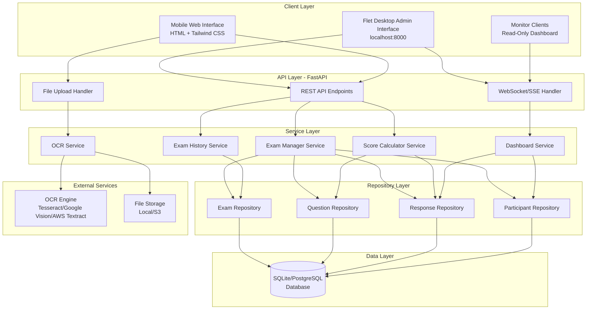
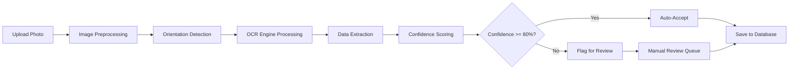
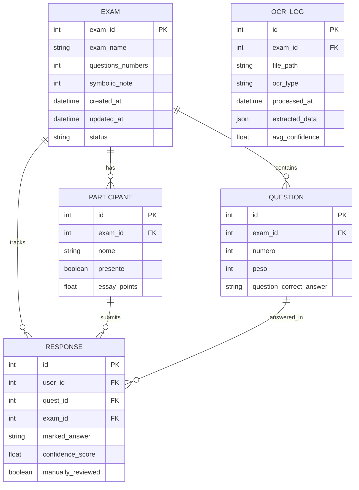
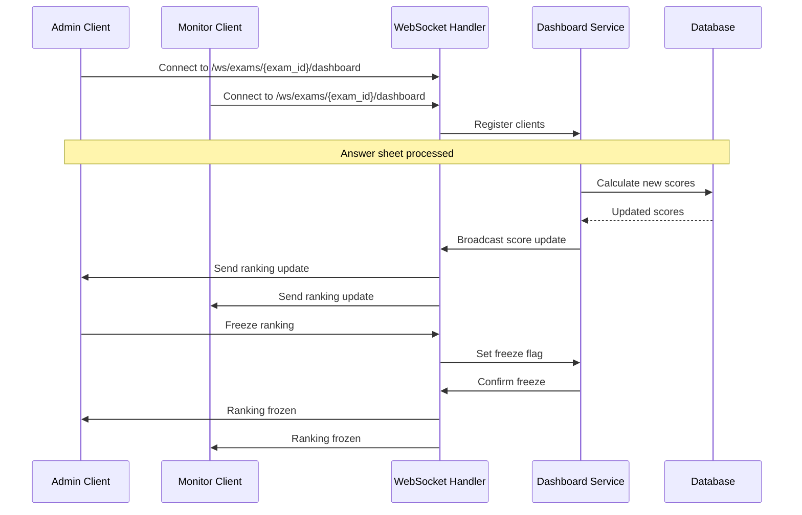

# Design Document: Multi-Exam OCR System

## Overview

The Multi-Exam OCR System transforms the existing single-exam "Enem da Read" application into a comprehensive multi-exam management platform with automated answer sheet processing capabilities. The system enables administrators to manage multiple independent exam sessions, import answer keys and participant responses through photo scanning with OCR technology, and maintain historical exam data with automated scoring and real-time monitoring.

### Key Features

- **Multi-Exam Management**: Create and manage multiple independent exam sessions with separate configurations
- **OCR Integration**: Automated extraction of answer keys and participant responses from uploaded photos
- **Dual Interface Architecture**: 
  - Flet Desktop Admin Interface (localhost) for full control and real-time monitoring
  - Mobile Web Interface (HTML + CSS Tailwind) for photo submission and essay points
- **Real-Time Dashboard**: Live ranking updates with WebSocket/SSE for administrators and monitor clients
- **Essay Points Management**: Manual addition of subjective grading scores
- **Exam History**: Complete historical data with cross-exam performance comparison
- **Automated Scoring**: Intelligent score calculation comparing marked answers with correct answers

### Design Goals

1. **Scalability**: Support hundreds of exams with thousands of participants each
2. **Accuracy**: Achieve 95%+ OCR accuracy with confidence scoring and manual review
3. **Performance**: Process answer sheets within 30 seconds, update dashboards within 5 seconds
4. **Usability**: Flet desktop admin interface, mobile-friendly HTML/Tailwind photo upload, clear real-time feedback
5. **Reliability**: Data integrity through database constraints, transaction management, and audit logging
6. **Maintainability**: Clean architecture with separation of concerns, dependency injection, and comprehensive testing

## Architecture

### High-Level Architecture



### Architectural Patterns

1. **Layered Architecture**: Clear separation between API, Service, Repository, and Data layers
2. **Repository Pattern**: Abstract data access with interfaces for testability
3. **Dependency Injection**: Services receive dependencies through constructors
4. **Event-Driven Updates**: WebSocket/SSE for real-time dashboard synchronization
5. **Async Processing**: FastAPI async endpoints with async SQLAlchemy for non-blocking I/O

### Technology Stack

- **Backend Framework**: FastAPI (async Python web framework)
- **ORM**: SQLAlchemy 2.0 with async support
- **Database**: SQLite (development), PostgreSQL (production)
- **OCR Engines**: Tesseract OCR (primary), Google Vision API (fallback), AWS Textract (optional)
- **Real-Time Communication**: WebSocket or Server-Sent Events (SSE)
- **Image Processing**: OpenCV, Pillow
- **Data Validation**: Pydantic v2
- **File Storage**: Local filesystem (development), AWS S3 (production)
- **Desktop Frontend**: Flet (Python-based UI framework) — consumes the FastAPI REST API
- **Mobile Frontend**: HTML + CSS (Tailwind) + vanilla JS — mobile-first, consumes the FastAPI REST API

## Components and Interfaces

### 1. Exam Manager Service

**Responsibilities**:
- Create, read, update, delete exam sessions
- Manage exam configuration (name, question count, symbolic note)
- Coordinate participant, question, and response associations
- Handle database migrations from single-exam to multi-exam structure

**Key Methods**:
```python
class ExamManagerService:
    async def create_exam(self, exam_data: ExamCreate) -> ExamResponse
    async def get_exam(self, exam_id: int) -> ExamResponse
    async def update_exam(self, exam_id: int, exam_data: ExamUpdate) -> ExamResponse
    async def delete_exam(self, exam_id: int) -> bool
    async def list_exams(self, filters: ExamFilters) -> List[ExamResponse]
    async def add_participant_to_exam(self, exam_id: int, participant_data: ParticipanteCreate) -> ParticipanteResponse
```

### 2. OCR Service

**Responsibilities**:
- Process uploaded photos (answer keys and answer sheets)
- Extract structured data (question numbers, answer options)
- Assign confidence scores to extracted data
- Flag low-confidence extractions for manual review
- Support multiple OCR engine backends

**Key Methods**:
```python
class OCRService:
    async def process_answer_key(self, image_file: UploadFile, exam_id: int) -> AnswerKeyResult
    async def process_answer_sheet(self, image_file: UploadFile, participant_id: int, exam_id: int) -> AnswerSheetResult
    async def preprocess_image(self, image: np.ndarray) -> np.ndarray
    async def extract_answers(self, image: np.ndarray, template: AnswerSheetTemplate) -> List[ExtractedAnswer]
    async def validate_extraction(self, extracted_data: List[ExtractedAnswer], exam_id: int) -> ValidationResult
```

**OCR Processing Pipeline**:


### 3. Score Calculator Service

**Responsibilities**:
- Calculate raw scores by comparing marked answers with correct answers
- Calculate normalized scores using symbolic note
- Add essay points to final scores
- Provide score breakdowns and statistics

**Key Methods**:
```python
class ScoreCalculatorService:
    async def calculate_participant_score(self, participant_id: int, exam_id: int) -> ScoreResult
    async def calculate_all_scores(self, exam_id: int) -> List[ScoreResult]
    async def get_score_breakdown(self, participant_id: int, exam_id: int) -> ScoreBreakdown
    async def calculate_exam_statistics(self, exam_id: int) -> ExamStatistics
```

**Score Calculation Formula**:
```
raw_score = Σ(peso for each correct response)
total_possible_score = Σ(peso for all questions)
normalized_score = (raw_score / total_possible_score) * symbolic_note
final_score = normalized_score + essay_points
```

### 4. Exam History Service

**Responsibilities**:
- Retrieve historical exam data
- Generate exam result reports
- Support cross-exam performance comparison
- Export results to Excel format

**Key Methods**:
```python
class ExamHistoryService:
    async def get_exam_results(self, exam_id: int) -> ExamResults
    async def get_participant_history(self, participant_name: str) -> List[ParticipantExamHistory]
    async def compare_exams(self, exam_ids: List[int]) -> ExamComparison
    async def export_results_to_excel(self, exam_id: int) -> bytes
    async def get_question_statistics(self, exam_id: int) -> List[QuestionStats]
```

### 5. Dashboard Service

**Responsibilities**:
- Provide real-time ranking updates
- Manage WebSocket/SSE connections
- Broadcast score changes to connected clients
- Calculate aggregate statistics

**Key Methods**:
```python
class DashboardService:
    async def get_live_ranking(self, exam_id: int) -> LiveRanking
    async def broadcast_score_update(self, exam_id: int, participant_id: int) -> None
    async def get_dashboard_statistics(self, exam_id: int) -> DashboardStats
    async def freeze_ranking(self, exam_id: int, freeze: bool) -> bool
    async def format_ranking_as_text(self, exam_id: int) -> str
```

### 6. Repository Layer

**Interfaces**:
```python
class IExamRepository(ABC):
    @abstractmethod
    async def create(self, exam: Exam) -> Exam
    @abstractmethod
    async def get_by_id(self, exam_id: int) -> Optional[Exam]
    @abstractmethod
    async def update(self, exam: Exam) -> Exam
    @abstractmethod
    async def delete(self, exam_id: int) -> bool
    @abstractmethod
    async def list_all(self, filters: ExamFilters) -> List[Exam]

class IQuestionRepository(ABC):
    @abstractmethod
    async def create_bulk(self, questions: List[Question]) -> List[Question]
    @abstractmethod
    async def get_by_exam(self, exam_id: int) -> List[Question]
    @abstractmethod
    async def update(self, question: Question) -> Question

class IResponseRepository(ABC):
    @abstractmethod
    async def create_or_update(self, response: Response) -> Response
    @abstractmethod
    async def get_by_participant_and_exam(self, participant_id: int, exam_id: int) -> List[Response]
    @abstractmethod
    async def get_by_exam(self, exam_id: int) -> List[Response]

class IParticipantRepository(ABC):
    @abstractmethod
    async def create(self, participant: Participant) -> Participant
    @abstractmethod
    async def get_by_exam(self, exam_id: int) -> List[Participant]
    @abstractmethod
    async def update(self, participant: Participant) -> Participant
```

## Data Models

### Database Schema



### Entity Definitions

#### Exam Entity
```python
class Exam(Base):
    __tablename__ = "exams"
    
    exam_id = Column(Integer, primary_key=True)
    exam_name = Column(String(255), nullable=False)
    questions_numbers = Column(Integer, nullable=False)
    symbolic_note = Column(Integer, nullable=False, default=1000)
    created_at = Column(DateTime, default=datetime.utcnow)
    updated_at = Column(DateTime, default=datetime.utcnow, onupdate=datetime.utcnow)
    status = Column(String(50), default="draft")  # draft, in_progress, completed
    
    # Relationships
    questions = relationship("Question", back_populates="exam", cascade="all, delete-orphan")
    participants = relationship("Participant", back_populates="exam", cascade="all, delete-orphan")
    responses = relationship("Response", back_populates="exam", cascade="all, delete-orphan")
```

#### Question Entity (Enhanced)
```python
class Question(Base):
    __tablename__ = "questoes"
    
    id = Column(Integer, primary_key=True)
    exam_id = Column(Integer, ForeignKey("exams.exam_id"), nullable=False)
    numero = Column(Integer, nullable=False)
    peso = Column(Integer, default=1)
    question_correct_answer = Column(String(10), nullable=True)  # A, B, C, D, E, etc.
    
    # Relationships
    exam = relationship("Exam", back_populates="questions")
    responses = relationship("Response", back_populates="question", cascade="all, delete-orphan")
    
    # Constraints
    __table_args__ = (
        UniqueConstraint("exam_id", "numero", name="uq_exam_question_number"),
        Index("idx_exam_questions", "exam_id"),
    )
```

#### Participant Entity (Enhanced)
```python
class Participant(Base):
    __tablename__ = "participantes"
    
    id = Column(Integer, primary_key=True)
    exam_id = Column(Integer, ForeignKey("exams.exam_id"), nullable=False)
    nome = Column(String(255), nullable=False)
    presente = Column(Boolean, default=False)
    essay_points = Column(Float, default=0.0)
    
    # Relationships
    exam = relationship("Exam", back_populates="participants")
    responses = relationship("Response", back_populates="participant", cascade="all, delete-orphan")
    
    # Constraints
    __table_args__ = (
        Index("idx_exam_participants", "exam_id"),
    )
```

#### Response Entity (Enhanced)
```python
class Response(Base):
    __tablename__ = "resultados"
    
    id = Column(Integer, primary_key=True)
    user_id = Column(Integer, ForeignKey("participantes.id"), nullable=False)
    quest_id = Column(Integer, ForeignKey("questoes.id"), nullable=False)
    exam_id = Column(Integer, ForeignKey("exams.exam_id"), nullable=False)
    marked_answer = Column(String(10), nullable=True)  # A, B, C, D, E, etc.
    confidence_score = Column(Float, nullable=True)  # 0-100
    manually_reviewed = Column(Boolean, default=False)
    
    # Relationships
    participant = relationship("Participant", back_populates="responses")
    question = relationship("Question", back_populates="responses")
    exam = relationship("Exam", back_populates="responses")
    
    # Constraints
    __table_args__ = (
        UniqueConstraint("user_id", "quest_id", name="uq_usuario_questao"),
        Index("idx_exam_responses", "exam_id"),
        Index("idx_participant_responses", "user_id"),
    )
```

#### OCR Log Entity (New)
```python
class OCRLog(Base):
    __tablename__ = "ocr_logs"
    
    id = Column(Integer, primary_key=True)
    exam_id = Column(Integer, ForeignKey("exams.exam_id"), nullable=False)
    file_path = Column(String(500), nullable=False)
    ocr_type = Column(String(50), nullable=False)  # answer_key, answer_sheet
    processed_at = Column(DateTime, default=datetime.utcnow)
    extracted_data = Column(JSON, nullable=True)
    avg_confidence = Column(Float, nullable=True)
    error_message = Column(Text, nullable=True)
    
    # Relationships
    exam = relationship("Exam")
```

### Pydantic Schemas

#### Exam Schemas
```python
class ExamBase(BaseModel):
    exam_name: str = Field(..., min_length=1, max_length=255)
    questions_numbers: int = Field(..., gt=0)
    symbolic_note: int = Field(1000, gt=0)

class ExamCreate(ExamBase):
    pass

class ExamUpdate(BaseModel):
    exam_name: Optional[str] = Field(None, min_length=1, max_length=255)
    questions_numbers: Optional[int] = Field(None, gt=0)
    symbolic_note: Optional[int] = Field(None, gt=0)
    status: Optional[str] = Field(None, pattern="^(draft|in_progress|completed)$")

class ExamResponse(ExamBase):
    exam_id: int
    created_at: datetime
    updated_at: datetime
    status: str
    
    class Config:
        from_attributes = True
```

#### Question Schemas
```python
class QuestionBase(BaseModel):
    numero: int = Field(..., gt=0)
    peso: int = Field(1, gt=0, le=100)
    question_correct_answer: Optional[str] = Field(None, pattern="^[A-Z0-9]$")

class QuestionCreate(QuestionBase):
    exam_id: int

class QuestionResponse(QuestionBase):
    id: int
    exam_id: int
    
    class Config:
        from_attributes = True
```

#### Response Schemas
```python
class ResponseBase(BaseModel):
    marked_answer: Optional[str] = Field(None, pattern="^[A-Z0-9]$")

class ResponseCreate(ResponseBase):
    user_id: int
    quest_id: int
    exam_id: int
    confidence_score: Optional[float] = Field(None, ge=0, le=100)

class ResponseResponse(ResponseBase):
    id: int
    user_id: int
    quest_id: int
    exam_id: int
    confidence_score: Optional[float]
    manually_reviewed: bool
    
    class Config:
        from_attributes = True
```

#### Participant Schemas
```python
class ParticipantBase(BaseModel):
    nome: str = Field(..., min_length=1, max_length=255)

class ParticipantCreate(ParticipantBase):
    exam_id: int

class ParticipantUpdate(BaseModel):
    nome: Optional[str] = Field(None, min_length=1, max_length=255)
    presente: Optional[bool] = None
    essay_points: Optional[float] = Field(None, ge=0)

class ParticipantResponse(ParticipantBase):
    id: int
    exam_id: int
    presente: bool
    essay_points: float
    
    class Config:
        from_attributes = True
```

#### OCR Schemas
```python
class ExtractedAnswer(BaseModel):
    question_number: int
    answer: str
    confidence: float

class AnswerKeyResult(BaseModel):
    exam_id: int
    extracted_answers: List[ExtractedAnswer]
    avg_confidence: float
    flagged_count: int
    success: bool
    error_message: Optional[str] = None

class AnswerSheetResult(BaseModel):
    participant_id: int
    exam_id: int
    extracted_answers: List[ExtractedAnswer]
    avg_confidence: float
    flagged_count: int
    success: bool
    error_message: Optional[str] = None
```

#### Score Schemas
```python
class ScoreBreakdown(BaseModel):
    participant_id: int
    participant_name: str
    raw_score: float
    total_possible_score: float
    normalized_score: float
    essay_points: float
    final_score: float
    correct_count: int
    total_questions: int
    accuracy_percentage: float

class ExamStatistics(BaseModel):
    exam_id: int
    total_participants: int
    participants_with_submissions: int
    average_score: float
    median_score: float
    highest_score: float
    lowest_score: float
    std_deviation: float
```

## API Endpoints

### Exam Management Endpoints

```
POST   /api/v1/exams                    # Create new exam
GET    /api/v1/exams                    # List all exams (with filters)
GET    /api/v1/exams/{exam_id}          # Get exam details
PATCH  /api/v1/exams/{exam_id}          # Update exam
DELETE /api/v1/exams/{exam_id}          # Delete exam
GET    /api/v1/exams/{exam_id}/results  # Get exam results
```

### Participant Management Endpoints

```
POST   /api/v1/exams/{exam_id}/participants              # Add participant manually
GET    /api/v1/exams/{exam_id}/participants              # List participants
PATCH  /api/v1/participants/{participant_id}             # Update participant (name, attendance, essay points)
DELETE /api/v1/participants/{participant_id}             # Delete participant
POST   /api/v1/exams/{exam_id}/participants/import       # Import participants from Excel
```

### Question Management Endpoints

```
GET    /api/v1/exams/{exam_id}/questions                 # List questions
PATCH  /api/v1/questions/{question_id}                   # Update question (weight, correct answer)
```

### OCR Processing Endpoints

```
POST   /api/v1/exams/{exam_id}/ocr/answer-key            # Upload answer key photo
POST   /api/v1/exams/{exam_id}/ocr/answer-sheet          # Upload answer sheet photo
GET    /api/v1/exams/{exam_id}/ocr/flagged               # Get flagged answers for review
PATCH  /api/v1/responses/{response_id}/review            # Manually review/correct OCR result
```

### Dashboard Endpoints

```
GET    /api/v1/exams/{exam_id}/dashboard                 # Get dashboard data
WS     /api/v1/exams/{exam_id}/dashboard/live            # WebSocket for real-time updates
GET    /api/v1/exams/{exam_id}/dashboard/ranking         # Get current ranking
POST   /api/v1/exams/{exam_id}/dashboard/freeze          # Freeze/unfreeze ranking
GET    /api/v1/exams/{exam_id}/dashboard/ranking/text    # Get ranking as formatted text
```

### History and Export Endpoints

```
GET    /api/v1/exams/{exam_id}/statistics                # Get exam statistics
GET    /api/v1/exams/{exam_id}/export/excel              # Export results to Excel
GET    /api/v1/participants/{participant_name}/history   # Get participant history across exams
POST   /api/v1/exams/compare                             # Compare multiple exams
```

### Example API Request/Response

**POST /api/v1/exams**
```json
Request:
{
  "exam_name": "Simulado ENEM 2024 - Matemática",
  "questions_numbers": 45,
  "symbolic_note": 1000
}

Response:
{
  "exam_id": 1,
  "exam_name": "Simulado ENEM 2024 - Matemática",
  "questions_numbers": 45,
  "symbolic_note": 1000,
  "created_at": "2024-01-15T10:30:00Z",
  "updated_at": "2024-01-15T10:30:00Z",
  "status": "draft"
}
```

**POST /api/v1/exams/1/ocr/answer-key**
```json
Request: multipart/form-data
- file: [image file]

Response:
{
  "exam_id": 1,
  "extracted_answers": [
    {"question_number": 1, "answer": "A", "confidence": 98.5},
    {"question_number": 2, "answer": "C", "confidence": 95.2},
    {"question_number": 3, "answer": "B", "confidence": 72.1}
  ],
  "avg_confidence": 88.6,
  "flagged_count": 1,
  "success": true,
  "error_message": null
}
```

## Database Migration Strategy

### Migration Script Structure

```python
# migrations/001_single_to_multi_exam.py

async def upgrade():
    # Step 1: Create Exam table
    await create_exam_table()
    
    # Step 2: Create default "Legacy Exam"
    legacy_exam = await create_legacy_exam()
    
    # Step 3: Add exam_id columns to existing tables
    await add_exam_id_to_questions()
    await add_exam_id_to_participants()
    await add_exam_id_to_responses()
    
    # Step 4: Populate exam_id with legacy_exam.exam_id
    await populate_legacy_exam_ids(legacy_exam.exam_id)
    
    # Step 5: Add essay_points to participants
    await add_essay_points_to_participants()
    
    # Step 6: Transform responses (acertou -> marked_answer)
    await transform_responses()
    
    # Step 7: Add question_correct_answer to questions
    await add_correct_answer_to_questions()
    
    # Step 8: Create indexes and constraints
    await create_indexes()
    
    # Step 9: Validate data integrity
    await validate_migration()

async def create_legacy_exam():
    # Get config values
    config = await get_config()
    
    # Create legacy exam
    exam = Exam(
        exam_name="Legacy Exam",
        questions_numbers=await count_existing_questions(),
        symbolic_note=config.nota_simb if config else 1000,
        status="completed"
    )
    return await save_exam(exam)

async def transform_responses():
    # For responses with acertou=True, set marked_answer to match correct answer
    # For responses with acertou=False, set marked_answer to a different value
    # This is a best-effort transformation since we don't have original marked answers
    pass
```

### Data Integrity Checks

```python
async def validate_migration():
    # Check 1: All questions have exam_id
    orphan_questions = await count_questions_without_exam()
    assert orphan_questions == 0
    
    # Check 2: All participants have exam_id
    orphan_participants = await count_participants_without_exam()
    assert orphan_participants == 0
    
    # Check 3: All responses have exam_id
    orphan_responses = await count_responses_without_exam()
    assert orphan_responses == 0
    
    # Check 4: All foreign keys are valid
    await validate_foreign_keys()
    
    # Check 5: Unique constraints are satisfied
    await validate_unique_constraints()
```


## OCR Processing Pipeline

### Image Preprocessing

```python
async def preprocess_image(image: np.ndarray) -> np.ndarray:
    """
    Preprocess image for optimal OCR accuracy
    """
    # 1. Convert to grayscale
    gray = cv2.cvtColor(image, cv2.COLOR_BGR2GRAY)
    
    # 2. Detect and correct orientation
    angle = detect_orientation(gray)
    if abs(angle) > 1:
        gray = rotate_image(gray, angle)
    
    # 3. Apply adaptive histogram equalization for lighting correction
    clahe = cv2.createCLAHE(clipLimit=2.0, tileGridSize=(8,8))
    enhanced = clahe.apply(gray)
    
    # 4. Denoise
    denoised = cv2.fastNlMeansDenoising(enhanced)
    
    # 5. Binarization (Otsu's method)
    _, binary = cv2.threshold(denoised, 0, 255, cv2.THRESH_BINARY + cv2.THRESH_OTSU)
    
    return binary
```

### Answer Sheet Template System

```python
class AnswerSheetTemplate:
    """
    Defines the layout and structure of an answer sheet
    """
    template_id: str
    name: str
    question_count: int
    answer_options: List[str]  # e.g., ["A", "B", "C", "D", "E"]
    layout_type: str  # "vertical", "horizontal", "grid"
    
    # Coordinates for answer regions (relative to sheet size)
    answer_regions: List[AnswerRegion]
    
    # Detection parameters
    bubble_min_area: int
    bubble_max_area: int
    fill_threshold: float  # Percentage of bubble filled to consider marked

class AnswerRegion:
    question_number: int
    x: int
    y: int
    width: int
    height: int
    options: List[OptionCoordinate]

class OptionCoordinate:
    option: str  # "A", "B", "C", etc.
    x: int
    y: int
    radius: int
```

### Answer Detection Algorithm

```python
async def detect_marked_answers(
    image: np.ndarray, 
    template: AnswerSheetTemplate
) -> List[ExtractedAnswer]:
    """
    Detect which answer options are marked on the sheet
    """
    results = []
    
    for region in template.answer_regions:
        marked_option = None
        max_fill_percentage = 0
        
        for option_coord in region.options:
            # Extract bubble region
            bubble = extract_bubble_region(image, option_coord)
            
            # Calculate fill percentage
            fill_percentage = calculate_fill_percentage(bubble)
            
            # Check if marked
            if fill_percentage > template.fill_threshold:
                if fill_percentage > max_fill_percentage:
                    marked_option = option_coord.option
                    max_fill_percentage = fill_percentage
        
        # Calculate confidence based on fill clarity
        confidence = calculate_confidence(max_fill_percentage, template.fill_threshold)
        
        results.append(ExtractedAnswer(
            question_number=region.question_number,
            answer=marked_option if marked_option else "",
            confidence=confidence
        ))
    
    return results

def calculate_confidence(fill_percentage: float, threshold: float) -> float:
    """
    Calculate confidence score based on how clearly marked the answer is
    """
    if fill_percentage < threshold:
        return 0.0
    
    # Confidence increases with fill percentage above threshold
    # Max confidence at 90%+ fill
    normalized = (fill_percentage - threshold) / (0.9 - threshold)
    return min(100.0, normalized * 100)
```

### OCR Engine Abstraction

```python
class OCREngine(ABC):
    @abstractmethod
    async def extract_text(self, image: np.ndarray) -> str:
        pass
    
    @abstractmethod
    async def extract_structured_data(
        self, 
        image: np.ndarray, 
        template: AnswerSheetTemplate
    ) -> List[ExtractedAnswer]:
        pass

class TesseractOCREngine(OCREngine):
    async def extract_text(self, image: np.ndarray) -> str:
        return pytesseract.image_to_string(image)
    
    async def extract_structured_data(
        self, 
        image: np.ndarray, 
        template: AnswerSheetTemplate
    ) -> List[ExtractedAnswer]:
        # Use template-based bubble detection
        return await detect_marked_answers(image, template)

class GoogleVisionOCREngine(OCREngine):
    async def extract_text(self, image: np.ndarray) -> str:
        # Call Google Vision API
        client = vision.ImageAnnotatorClient()
        image_bytes = cv2.imencode('.jpg', image)[1].tobytes()
        response = client.text_detection(image=vision.Image(content=image_bytes))
        return response.text_annotations[0].description if response.text_annotations else ""
    
    async def extract_structured_data(
        self, 
        image: np.ndarray, 
        template: AnswerSheetTemplate
    ) -> List[ExtractedAnswer]:
        # Use Google Vision with template guidance
        pass
```

## Real-Time Dashboard Architecture

### WebSocket Communication Flow



### WebSocket Handler Implementation

```python
class DashboardWebSocketHandler:
    def __init__(self):
        self.active_connections: Dict[int, List[WebSocket]] = {}
        self.frozen_exams: Set[int] = set()
    
    async def connect(self, websocket: WebSocket, exam_id: int):
        await websocket.accept()
        if exam_id not in self.active_connections:
            self.active_connections[exam_id] = []
        self.active_connections[exam_id].append(websocket)
        
        # Send initial data
        ranking = await self.dashboard_service.get_live_ranking(exam_id)
        await websocket.send_json(ranking.dict())
    
    async def disconnect(self, websocket: WebSocket, exam_id: int):
        if exam_id in self.active_connections:
            self.active_connections[exam_id].remove(websocket)
    
    async def broadcast_update(self, exam_id: int, update_data: dict):
        if exam_id in self.frozen_exams:
            return  # Don't broadcast if frozen
        
        if exam_id in self.active_connections:
            disconnected = []
            for connection in self.active_connections[exam_id]:
                try:
                    await connection.send_json(update_data)
                except:
                    disconnected.append(connection)
            
            # Clean up disconnected clients
            for conn in disconnected:
                self.active_connections[exam_id].remove(conn)
    
    async def freeze_ranking(self, exam_id: int, freeze: bool):
        if freeze:
            self.frozen_exams.add(exam_id)
        else:
            self.frozen_exams.discard(exam_id)
        
        await self.broadcast_update(exam_id, {
            "type": "freeze_status",
            "frozen": freeze
        })
```

### Dashboard Update Message Format

```json
{
  "type": "ranking_update",
  "timestamp": "2024-01-15T14:30:45Z",
  "exam_id": 1,
  "ranking": [
    {
      "rank": 1,
      "participant_id": 42,
      "participant_name": "João Silva",
      "score": 875.5,
      "questions_answered": 45,
      "rank_change": 0,
      "score_change": 12.5
    },
    {
      "rank": 2,
      "participant_id": 15,
      "participant_name": "Maria Santos",
      "score": 850.0,
      "questions_answered": 45,
      "rank_change": -1,
      "score_change": 0
    }
  ],
  "statistics": {
    "total_participants": 120,
    "participants_with_submissions": 85,
    "average_score": 650.5,
    "highest_score": 875.5
  }
}
```

## Interface Specifications

### Web PC Admin Interface (Localhost)

**Purpose**: Full control interface for administrators running on localhost

**Key Features**:
- Exam creation and configuration
- Participant management (add, edit, delete)
- Question management (edit weights, correct answers)
- OCR result review and correction
- Real-time dashboard with control functions
- Essay points management
- Export functionality

**Access Control**:
- Full read/write access
- Can start/end exams
- Can freeze/unfreeze rankings
- Can edit all data

**Technology**:
- HTML/CSS/JavaScript
- Responsive design (desktop-optimized)
- WebSocket for real-time updates

### Photo Upload Interface (Mobile)

**Purpose**: Simplified mobile interface for photo uploads and essay points

**Key Features**:
- Camera integration for photo capture
- Photo upload with preview
- Essay points editing only
- Upload progress tracking
- OCR result preview

**Access Control**:
- Can upload photos (answer keys and sheets)
- Can edit essay points
- Cannot add participants manually
- Cannot view full dashboard
- Cannot control exam status

**Technology**:
- Mobile-first responsive design
- Progressive Web App (PWA) capabilities
- Optimized for touch interfaces
- Image compression before upload

### Monitor Client (Read-Only Dashboard)

**Purpose**: Display-only interface for viewing live rankings on additional screens

**Key Features**:
- Real-time ranking display
- Aggregate statistics
- Large font sizes for visibility
- Auto-refresh

**Access Control**:
- Read-only access
- Cannot modify any data
- Cannot control exam
- Cannot freeze rankings

**Technology**:
- Same as Web PC Admin Interface
- Simplified UI with larger elements
- WebSocket for real-time updates

## Error Handling

### Error Categories

1. **Validation Errors** (HTTP 422)
   - Invalid input data
   - Schema validation failures
   - Business rule violations

2. **Not Found Errors** (HTTP 404)
   - Resource doesn't exist
   - Invalid IDs

3. **Conflict Errors** (HTTP 409)
   - Duplicate entries
   - Constraint violations

4. **OCR Processing Errors** (HTTP 500)
   - Image processing failures
   - OCR engine errors
   - Low confidence extractions

5. **Database Errors** (HTTP 500)
   - Connection failures
   - Transaction errors
   - Integrity constraint violations

### Error Response Format

```json
{
  "error": {
    "code": "VALIDATION_ERROR",
    "message": "Invalid exam configuration",
    "details": [
      {
        "field": "questions_numbers",
        "message": "Must be greater than 0"
      }
    ],
    "timestamp": "2024-01-15T14:30:45Z",
    "request_id": "req_abc123"
  }
}
```

### Exception Handling Strategy

```python
class AppException(Exception):
    def __init__(self, message: str, status_code: int = 500, code: str = "INTERNAL_ERROR"):
        self.message = message
        self.status_code = status_code
        self.code = code

class ValidationException(AppException):
    def __init__(self, message: str, details: List[dict] = None):
        super().__init__(message, status_code=422, code="VALIDATION_ERROR")
        self.details = details or []

class NotFoundException(AppException):
    def __init__(self, resource: str, identifier: any):
        message = f"{resource} with id {identifier} not found"
        super().__init__(message, status_code=404, code="NOT_FOUND")

class OCRProcessingException(AppException):
    def __init__(self, message: str, confidence: float = None):
        super().__init__(message, status_code=500, code="OCR_ERROR")
        self.confidence = confidence

# Global exception handler
@app.exception_handler(AppException)
async def app_exception_handler(request: Request, exc: AppException):
    return JSONResponse(
        status_code=exc.status_code,
        content={
            "error": {
                "code": exc.code,
                "message": exc.message,
                "timestamp": datetime.utcnow().isoformat(),
                "request_id": request.state.request_id
            }
        }
    )
```

### OCR Error Recovery

```python
async def process_answer_sheet_with_retry(
    image_file: UploadFile,
    participant_id: int,
    exam_id: int,
    max_retries: int = 3
) -> AnswerSheetResult:
    """
    Process answer sheet with automatic retry and fallback
    """
    engines = [
        TesseractOCREngine(),
        GoogleVisionOCREngine(),
        # AWSTextractOCREngine()  # Optional fallback
    ]
    
    for attempt in range(max_retries):
        try:
            engine = engines[min(attempt, len(engines) - 1)]
            result = await engine.process_answer_sheet(image_file, participant_id, exam_id)
            
            if result.avg_confidence >= 80:
                return result
            
            # Low confidence, try next engine
            continue
            
        except OCRProcessingException as e:
            if attempt == max_retries - 1:
                raise
            continue
    
    raise OCRProcessingException(
        "Failed to process answer sheet with acceptable confidence after all retries"
    )
```


## Correctness Properties

*A property is a characteristic or behavior that should hold true across all valid executions of a system—essentially, a formal statement about what the system should do. Properties serve as the bridge between human-readable specifications and machine-verifiable correctness guarantees.*

### Acceptance Criteria Testing Prework

Before defining correctness properties, I analyzed each acceptance criterion for testability:

**Requirement 1: Exam Entity Management**

1.1 THE Exam_Manager SHALL create a new Exam entity with exam_id, exam_name, questions_numbers, and symbolic_note
  Thoughts: This is testing that when we create an exam, all required fields are populated. We can generate random exam data and verify all fields are present and valid.
  Testable: yes - property

1.2 WHEN an Exam is created, THE Exam_Manager SHALL assign a unique exam_id as the primary key
  Thoughts: This is testing uniqueness across all exams. We can create multiple exams and verify all exam_ids are unique.
  Testable: yes - property

1.3 THE Exam_Manager SHALL store exam_name as a text field with minimum length of 1 character and maximum length of 255 characters
  Thoughts: This is input validation. We can test that valid names are accepted and invalid names (empty, too long) are rejected.
  Testable: yes - property

1.7 WHEN an Exam is deleted, THE Exam_Manager SHALL cascade delete all associated Questions, Responses, and Participant associations
  Thoughts: This is testing referential integrity. We can create an exam with associated data, delete it, and verify all related records are gone.
  Testable: yes - property

**Requirement 2: Enhanced Question Entity**

2.7 FOR ALL Questions associated with an Exam, THE Exam_Manager SHALL ensure question numbers are unique within that exam
  Thoughts: This is testing a uniqueness constraint within a scope. We can generate questions for an exam and verify no duplicate numbers exist.
  Testable: yes - property

**Requirement 3: Enhanced Response Entity**

3.6 THE Exam_Manager SHALL maintain the unique constraint on (user_id, quest_id) combination
  Thoughts: This is testing a composite unique constraint. We can attempt to create duplicate responses and verify they're rejected.
  Testable: yes - property

**Requirement 5: Official Answer Key OCR Import**

5.3 THE OCR_Service SHALL validate that extracted question numbers are positive integers within the exam's questions_numbers range
  Thoughts: This is input validation for OCR results. We can generate various OCR outputs and verify validation works correctly.
  Testable: yes - property

5.4 THE OCR_Service SHALL validate that extracted answer options match valid answer characters (A, B, C, D, E, etc.)
  Thoughts: This is input validation. We can test that valid answers are accepted and invalid ones are rejected.
  Testable: yes - property

**Requirement 6: Participant Answer Sheet OCR Import**

6.8 WHEN a Response already exists for a participant-question combination, THE Exam_Manager SHALL update the marked_answer value instead of creating a duplicate
  Thoughts: This is testing upsert behavior. We can create a response, then try to create it again with different data, and verify it updates rather than duplicates.
  Testable: yes - property

**Requirement 7: Automated Score Calculation**

7.1 WHEN calculating a participant's score, THE Score_Calculator SHALL compare each Response.marked_answer with the corresponding Question.question_correct_answer
  Thoughts: This is the core scoring logic. We can generate random responses and questions and verify correct comparison.
  Testable: yes - property

7.2 THE Score_Calculator SHALL count a response as correct when marked_answer exactly matches question_correct_answer (case-insensitive)
  Thoughts: This is testing the correctness criteria. We can test various combinations of marked and correct answers.
  Testable: yes - property

7.5 THE Score_Calculator SHALL calculate the normalized score using the formula: (raw_score / total_possible_score) * symbolic_note
  Thoughts: This is testing a mathematical formula. We can verify the calculation is correct for various inputs.
  Testable: yes - property

**Requirement 13: Database Migration and Backward Compatibility**

13.2 WHEN migration executes, THE Exam_Manager SHALL create a default Exam record for existing data with exam_name "Legacy Exam"
  Thoughts: This is testing a specific migration behavior. This is an example test for the migration script.
  Testable: yes - example

13.3 THE Exam_Manager SHALL associate all existing Participante, Questao, and Resposta records with the default Exam
  Thoughts: This is testing migration data integrity. We can verify all records have the correct exam_id after migration.
  Testable: yes - example

**Requirement 16: OCR Accuracy Validation**

16.1 THE OCR_Service SHALL provide a test mode that generates synthetic answer sheet images from known data
  Thoughts: This is a round-trip property - generate image from data, extract data from image, compare with original.
  Testable: yes - property

16.2 WHEN processing synthetic images, THE OCR_Service SHALL extract data and compare it with the original known data
  Thoughts: This is the round-trip verification. For any known data, generating an image and extracting should return the same data.
  Testable: yes - property

**Requirement 18: Essay Extra Points Management**

18.7 WHEN calculating final scores, THE Score_Calculator SHALL add essay_points to the normalized score for participants who have essay_points values
  Thoughts: This is testing the final score calculation formula. We can verify the addition is correct.
  Testable: yes - property

18.8 THE Score_Calculator SHALL calculate the final score using the formula: final_score = normalized_score + essay_points
  Thoughts: This is the same as 18.7, testing the formula.
  Testable: yes - property (redundant with 18.7)

**Property Reflection:**

After reviewing all testable properties, I identified the following redundancies:
- Properties 18.7 and 18.8 test the same formula and can be combined
- Property 7.5 (normalized score calculation) and properties 18.7/18.8 (final score calculation) are related but test different formulas, so both are needed

### Property 1: Exam Creation Completeness

*For any* valid exam data (name, question count, symbolic note), when creating an exam, the system should return an exam entity with all required fields populated (exam_id, exam_name, questions_numbers, symbolic_note, timestamps, status).

**Validates: Requirements 1.1**

### Property 2: Exam ID Uniqueness

*For any* set of created exams, all exam_id values should be unique across the entire system.

**Validates: Requirements 1.2**

### Property 3: Exam Name Validation

*For any* exam name input, the system should accept names with length between 1 and 255 characters and reject names outside this range.

**Validates: Requirements 1.3**

### Property 4: Cascade Delete Integrity

*For any* exam with associated questions, responses, and participants, when the exam is deleted, all associated records should also be deleted from the database.

**Validates: Requirements 1.7**

### Property 5: Question Number Uniqueness Within Exam

*For any* exam, all questions associated with that exam should have unique question numbers (no two questions in the same exam can have the same numero value).

**Validates: Requirements 2.7**

### Property 6: Response Uniqueness Constraint

*For any* participant and question combination, the system should allow only one response record and reject attempts to create duplicates.

**Validates: Requirements 3.6**

### Property 7: OCR Question Number Validation

*For any* OCR extraction result, all extracted question numbers should be positive integers within the range [1, exam.questions_numbers].

**Validates: Requirements 5.3**

### Property 8: OCR Answer Option Validation

*For any* OCR extraction result, all extracted answer options should match the valid answer character set (A-Z, 0-9) configured for the exam.

**Validates: Requirements 5.4**

### Property 9: Response Upsert Behavior

*For any* existing response record, when attempting to create a response with the same (user_id, quest_id) combination, the system should update the existing record's marked_answer instead of creating a duplicate.

**Validates: Requirements 6.8**

### Property 10: Score Calculation Correctness

*For any* participant's responses and corresponding questions, the score calculator should count a response as correct if and only if the marked_answer matches the question_correct_answer (case-insensitive).

**Validates: Requirements 7.1, 7.2**

### Property 11: Normalized Score Formula

*For any* participant's raw score, total possible score, and symbolic note, the normalized score should equal (raw_score / total_possible_score) * symbolic_note.

**Validates: Requirements 7.5**

### Property 12: Final Score Calculation

*For any* participant's normalized score and essay points, the final score should equal normalized_score + essay_points.

**Validates: Requirements 18.7, 18.8**

### Property 13: OCR Round-Trip Accuracy

*For any* valid answer sheet data, generating a synthetic image from that data and then extracting data from the image should produce data that matches the original with at least 95% accuracy.

**Validates: Requirements 16.1, 16.2**


## Testing Strategy

### Dual Testing Approach

The system will employ both unit testing and property-based testing to ensure comprehensive coverage:

- **Unit Tests**: Verify specific examples, edge cases, error conditions, and integration points
- **Property Tests**: Verify universal properties across all inputs through randomization

Both approaches are complementary and necessary. Unit tests catch concrete bugs in specific scenarios, while property tests verify general correctness across a wide range of inputs.

### Property-Based Testing Configuration

**Framework Selection**:
- **Python**: Hypothesis (primary property-based testing library)
- **Minimum Iterations**: 100 test cases per property test
- **Test Tagging**: Each property test must reference its design document property

**Example Property Test**:
```python
from hypothesis import given, strategies as st
import pytest

@given(
    exam_name=st.text(min_size=1, max_size=255),
    questions_numbers=st.integers(min_value=1, max_value=200),
    symbolic_note=st.integers(min_value=1, max_value=10000)
)
@pytest.mark.property_test
def test_property_1_exam_creation_completeness(exam_name, questions_numbers, symbolic_note):
    """
    Feature: multi-exam-ocr-system, Property 1: Exam Creation Completeness
    
    For any valid exam data, when creating an exam, the system should return
    an exam entity with all required fields populated.
    """
    # Arrange
    exam_data = ExamCreate(
        exam_name=exam_name,
        questions_numbers=questions_numbers,
        symbolic_note=symbolic_note
    )
    
    # Act
    result = await exam_service.create_exam(exam_data)
    
    # Assert
    assert result.exam_id is not None
    assert result.exam_name == exam_name
    assert result.questions_numbers == questions_numbers
    assert result.symbolic_note == symbolic_note
    assert result.created_at is not None
    assert result.updated_at is not None
    assert result.status in ["draft", "in_progress", "completed"]
```

### Unit Testing Strategy

**Test Categories**:

1. **Service Layer Tests**
   - Test business logic with mocked repositories
   - Verify error handling and validation
   - Test edge cases (empty data, null values, boundary conditions)

2. **Repository Layer Tests**
   - Test database operations with in-memory SQLite
   - Verify CRUD operations
   - Test transaction handling and rollback

3. **API Layer Tests**
   - Test endpoint request/response handling
   - Verify authentication and authorization
   - Test error responses and status codes

4. **OCR Processing Tests**
   - Test image preprocessing pipeline
   - Test answer detection algorithms
   - Test confidence scoring
   - Test error recovery and fallback mechanisms

5. **Integration Tests**
   - Test complete workflows (exam creation → OCR → scoring → dashboard)
   - Test WebSocket communication
   - Test database migrations

**Example Unit Test**:
```python
@pytest.mark.asyncio
async def test_cascade_delete_removes_all_associated_records():
    """
    Test that deleting an exam cascades to all associated records.
    
    This is a specific example test for cascade delete behavior.
    """
    # Arrange
    exam = await create_test_exam()
    await create_test_questions(exam.exam_id, count=5)
    await create_test_participants(exam.exam_id, count=10)
    await create_test_responses(exam.exam_id)
    
    # Act
    await exam_service.delete_exam(exam.exam_id)
    
    # Assert
    assert await exam_repo.get_by_id(exam.exam_id) is None
    assert len(await question_repo.get_by_exam(exam.exam_id)) == 0
    assert len(await participant_repo.get_by_exam(exam.exam_id)) == 0
    assert len(await response_repo.get_by_exam(exam.exam_id)) == 0
```

### OCR Testing Strategy

**Synthetic Test Data Generation**:
```python
class SyntheticAnswerSheetGenerator:
    """
    Generates synthetic answer sheet images for testing OCR accuracy.
    """
    
    def generate_answer_sheet(
        self,
        answers: Dict[int, str],
        template: AnswerSheetTemplate,
        noise_level: float = 0.0,
        rotation_angle: float = 0.0,
        brightness: float = 1.0
    ) -> np.ndarray:
        """
        Generate a synthetic answer sheet image with controlled variations.
        
        Args:
            answers: Dictionary mapping question numbers to answer options
            template: Answer sheet template defining layout
            noise_level: Amount of noise to add (0.0 to 1.0)
            rotation_angle: Rotation in degrees (-15 to 15)
            brightness: Brightness multiplier (0.5 to 1.5)
        
        Returns:
            Synthetic answer sheet image as numpy array
        """
        # Create blank sheet
        image = self._create_blank_sheet(template)
        
        # Draw answer bubbles
        for question_num, answer in answers.items():
            self._draw_marked_bubble(image, template, question_num, answer)
        
        # Apply transformations
        if noise_level > 0:
            image = self._add_noise(image, noise_level)
        if rotation_angle != 0:
            image = self._rotate_image(image, rotation_angle)
        if brightness != 1.0:
            image = self._adjust_brightness(image, brightness)
        
        return image

@given(
    answers=st.dictionaries(
        keys=st.integers(min_value=1, max_value=50),
        values=st.sampled_from(["A", "B", "C", "D", "E"]),
        min_size=10,
        max_size=50
    ),
    noise_level=st.floats(min_value=0.0, max_value=0.3),
    rotation_angle=st.floats(min_value=-10.0, max_value=10.0)
)
@pytest.mark.property_test
async def test_property_13_ocr_round_trip_accuracy(answers, noise_level, rotation_angle):
    """
    Feature: multi-exam-ocr-system, Property 13: OCR Round-Trip Accuracy
    
    For any valid answer sheet data, generating a synthetic image and extracting
    data should produce results matching the original with at least 95% accuracy.
    """
    # Arrange
    generator = SyntheticAnswerSheetGenerator()
    template = get_standard_template()
    
    # Act
    synthetic_image = generator.generate_answer_sheet(
        answers=answers,
        template=template,
        noise_level=noise_level,
        rotation_angle=rotation_angle
    )
    
    extracted = await ocr_service.extract_answers(synthetic_image, template)
    
    # Assert
    correct_count = sum(
        1 for q_num, answer in answers.items()
        if any(e.question_number == q_num and e.answer == answer for e in extracted)
    )
    
    accuracy = correct_count / len(answers)
    assert accuracy >= 0.95, f"OCR accuracy {accuracy:.2%} below 95% threshold"
```

### Test Coverage Goals

- **Line Coverage**: Minimum 80% for all modules
- **Branch Coverage**: Minimum 75% for business logic
- **Property Test Coverage**: All 13 correctness properties must have corresponding property tests
- **Integration Test Coverage**: All critical user workflows must have end-to-end tests

### Continuous Integration

**CI Pipeline**:
1. Run linting and type checking (mypy, flake8, black)
2. Run unit tests with coverage reporting
3. Run property tests (100 iterations minimum)
4. Run integration tests
5. Run OCR accuracy validation suite
6. Generate test reports and coverage badges

**Quality Gates**:
- All tests must pass
- Code coverage must meet minimum thresholds
- OCR accuracy must be ≥95% on test suite
- No critical security vulnerabilities (Bandit scan)

### Performance Testing

**Load Testing Scenarios**:
1. **Concurrent Photo Uploads**: 50 simultaneous uploads
2. **Dashboard Connections**: 100 concurrent WebSocket connections
3. **Score Calculation**: 1000 participants per exam
4. **Database Queries**: Response time under 100ms for 95th percentile

**Performance Benchmarks**:
- OCR processing: ≤30 seconds per answer sheet (100 questions)
- Score calculation: ≤2 seconds for 1000 participants
- Dashboard update broadcast: ≤5 seconds from score change to client update
- API response time: ≤200ms for 95th percentile

### Test Data Management

**Test Fixtures**:
```python
@pytest.fixture
async def test_exam():
    """Create a test exam with standard configuration."""
    exam = await exam_service.create_exam(ExamCreate(
        exam_name="Test Exam",
        questions_numbers=50,
        symbolic_note=1000
    ))
    yield exam
    await exam_service.delete_exam(exam.exam_id)

@pytest.fixture
async def test_questions(test_exam):
    """Create test questions for an exam."""
    questions = []
    for i in range(1, 51):
        question = await question_service.create_question(QuestionCreate(
            exam_id=test_exam.exam_id,
            numero=i,
            peso=1,
            question_correct_answer=random.choice(["A", "B", "C", "D", "E"])
        ))
        questions.append(question)
    return questions

@pytest.fixture
async def test_participants(test_exam):
    """Create test participants for an exam."""
    participants = []
    for i in range(1, 21):
        participant = await participant_service.create_participant(ParticipantCreate(
            exam_id=test_exam.exam_id,
            nome=f"Test Participant {i}"
        ))
        participants.append(participant)
    return participants
```

### Security Testing

**Security Test Cases**:
1. **SQL Injection**: Test all input fields with SQL injection payloads
2. **Path Traversal**: Test file upload with malicious filenames
3. **XSS**: Test all text inputs with XSS payloads
4. **Authentication**: Test unauthorized access to protected endpoints
5. **Rate Limiting**: Test API rate limits are enforced
6. **File Upload**: Test file size limits and type validation

### Regression Testing

**Regression Test Suite**:
- Maintain a suite of tests for all fixed bugs
- Run full regression suite before each release
- Tag tests with issue numbers for traceability

**Example Regression Test**:
```python
@pytest.mark.regression
@pytest.mark.issue_123
async def test_response_upsert_does_not_create_duplicates():
    """
    Regression test for issue #123: Duplicate responses created on re-upload.
    
    Verifies that uploading the same answer sheet twice updates the existing
    response instead of creating a duplicate.
    """
    # Arrange
    exam = await create_test_exam()
    participant = await create_test_participant(exam.exam_id)
    question = await create_test_question(exam.exam_id)
    
    # Act - First upload
    await response_service.create_or_update_response(ResponseCreate(
        user_id=participant.id,
        quest_id=question.id,
        exam_id=exam.exam_id,
        marked_answer="A"
    ))
    
    # Act - Second upload with different answer
    await response_service.create_or_update_response(ResponseCreate(
        user_id=participant.id,
        quest_id=question.id,
        exam_id=exam.exam_id,
        marked_answer="B"
    ))
    
    # Assert - Only one response exists
    responses = await response_repo.get_by_participant_and_exam(
        participant.id, exam.exam_id
    )
    assert len(responses) == 1
    assert responses[0].marked_answer == "B"
```

## Deployment Considerations

### Environment Configuration

**Development Environment**:
- SQLite database
- Local file storage
- Tesseract OCR only
- Debug mode enabled
- CORS allowing all origins

**Production Environment**:
- PostgreSQL database with connection pooling
- AWS S3 for file storage
- Multiple OCR engines (Tesseract + Google Vision)
- Debug mode disabled
- CORS restricted to specific origins
- HTTPS only
- Rate limiting enabled
- Monitoring and logging (Sentry, CloudWatch)

### Database Scaling

**Optimization Strategies**:
1. **Indexing**: Create indexes on all foreign keys and frequently queried fields
2. **Connection Pooling**: Configure SQLAlchemy pool size based on load
3. **Query Optimization**: Use eager loading for relationships, avoid N+1 queries
4. **Partitioning**: Consider table partitioning for large exam history tables
5. **Caching**: Implement Redis caching for frequently accessed data (exam configs, rankings)

### File Storage Strategy

**Development**: Local filesystem
**Production**: AWS S3 with lifecycle policies
- Original photos: Retain for 90 days
- Processed images: Retain for 30 days
- OCR logs: Retain for 1 year

### Monitoring and Observability

**Metrics to Track**:
- API response times (p50, p95, p99)
- OCR processing times and accuracy rates
- WebSocket connection counts
- Database query performance
- Error rates by endpoint
- File upload success/failure rates

**Alerting Thresholds**:
- API response time p95 > 500ms
- OCR accuracy < 90%
- Error rate > 5%
- Database connection pool exhaustion
- Disk space < 20%

### Backup and Recovery

**Backup Strategy**:
- Database: Daily automated backups with 30-day retention
- Files: S3 versioning enabled with lifecycle policies
- Configuration: Version controlled in Git

**Recovery Procedures**:
- Database restore from backup (RTO: 1 hour)
- Point-in-time recovery for critical data loss
- Disaster recovery plan documented

## Future Enhancements

### Phase 2 Features

1. **Advanced Analytics**
   - Question difficulty analysis
   - Participant performance trends
   - Comparative analytics across multiple exams

2. **Collaborative Features**
   - Multiple administrator roles
   - Shared exam templates
   - Team-based exam management

3. **Mobile App**
   - Native iOS/Android apps
   - Offline photo capture with sync
   - Push notifications for exam updates

4. **AI-Powered Features**
   - Automatic question difficulty prediction
   - Anomaly detection for cheating
   - Personalized study recommendations

5. **Integration Capabilities**
   - LMS integration (Moodle, Canvas)
   - Export to learning analytics platforms
   - API for third-party integrations

### Technical Debt and Refactoring

1. **Microservices Migration**: Consider splitting OCR processing into separate service
2. **Event Sourcing**: Implement event sourcing for audit trail and replay capabilities
3. **GraphQL API**: Add GraphQL endpoint for flexible client queries
4. **Kubernetes Deployment**: Containerize and deploy on Kubernetes for scalability

---

## Summary

This design document provides a comprehensive blueprint for transforming the single-exam "Enem da Read" application into a multi-exam OCR system. The architecture emphasizes:

- **Scalability**: Support for multiple exams with thousands of participants
- **Accuracy**: 95%+ OCR accuracy with confidence scoring and manual review
- **Real-time Updates**: WebSocket-based dashboard for live monitoring
- **Maintainability**: Clean layered architecture with dependency injection
- **Testability**: Comprehensive property-based and unit testing strategy
- **Flexibility**: Dual interface design for different use cases

The system is designed to be deployed incrementally, with clear migration paths from the existing single-exam structure to the new multi-exam architecture while maintaining backward compatibility.

